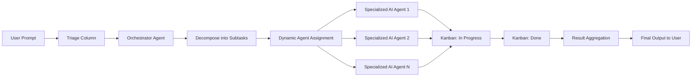

# Automating AI Agent Workflows with the Hermes Agent Kanban: Orchestration, Triage, and Dynamic Agent Assignment  

## Overview  
This course explores the recent automation upgrade to the Hermes Agent Kanban system, focusing on how a single user‑provided prompt can be ingested into a triage column, interpreted by an orchestrator agent, decomposed into granular subtasks, and automatically routed to suitably specialized AI agents. By studying this workflow, learners will understand the mechanics of prompt‑driven multi‑agent orchestration, the role of Kanban‑style visual management in AI agent teams, and how dynamic agent‑profile matching enables scalable, self‑organizing agent ecosystems. The material is valuable for developers, AI researchers, and product designers who wish to build or improve systems where heterogeneous agents collaborate to fulfill complex goals without manual task allocation.  

## Background & Context  
The Hermes Agent Kanban originates from the Hermes project, an open‑source initiative aimed at creating a flexible framework for coordinating multiple AI agents through visual task boards reminiscent of software development Kanban boards. Prior to the automation upgrade, users had to manually create cards for each subtask, select appropriate agent profiles, and move cards across columns as work progressed—a process that was both time‑consuming and error‑prone, especially when dealing with ambiguous or high‑level prompts. The upgrade announced by @Teknium on X (formerly Twitter) introduces an orchestrator agent that sits upstream of the triage column, capable of natural‑language understanding, task decomposition, and intelligent agent assignment. This advancement reflects a broader trend in AI agent research toward hierarchical control: a high‑level planner (the orchestrator) interprets user intent, while specialized workers (the agents) execute narrowly defined functions. By embedding this planner within a Kanban view, the system retains the transparency and workflow‑management benefits of Kanban while gaining the autonomy of automated task distribution. The upgrade thus bridges the gap between prompt‑centric interaction paradigms (e.g., chat‑style LLMs) and structured multi‑agent execution environments.  

## Core Concepts  

### Hermes Agent Kanban  
The Hermes Agent Kanban is a visual management board where each column represents a stage of work (e.g., Triage, In Progress, Review, Done) and each card corresponds to a discrete unit of work assigned to an AI agent. Unlike traditional Kanban used by human teams, the cards contain machine‑readable metadata such as required capabilities, priority, and deadlines. The board provides real‑time visibility into agent workload, bottlenecks, and completion status, enabling both human overseers and automated monitors to intervene when needed. The recent automation upgrade does not replace the board; rather, it augments the front‑end intake process so that cards are generated automatically from user prompts.  

### Orchestrator Agent  
The orchestrator agent is a dedicated AI agent responsible for interpreting incoming prompts, breaking them down into actionable subtasks, and mapping each subtask to the most suitable agent profile. It typically combines a large language model (LLM) for natural‑language understanding with a planning module (e.g., hierarchical task network or graph‑based planner) that outputs a directed acyclic graph (DAG) of subtasks. The orchestrator also maintains a registry of agent profiles, each describing the agent’s skill set, preferred tools, performance history, and current load. By continuously updating this registry, the orchestrator can make dynamic assignment decisions that adapt to changing agent availability or performance.  

### Triage Column  
In the Hermes Kanban, the Triage column is the initial holding area for newly received work items before they are clarified and scheduled. In the manual workflow, a human operator would read a prompt, decide what work it entails, and create corresponding cards. With the automation upgrade, the orchestrator agent directly populates the Triage column with one or more cards that represent the decomposed subtasks. The Triage column thus becomes a semi‑automated buffer where the orchestrator’s output can be inspected, edited, or prioritized before work begins.  

### Prompt Decomposition  
Prompt decomposition is the process of transforming a high‑level, natural‑language request into a set of lower‑level, executable tasks that can be assigned to specialized agents. This involves intent detection (identifying the user’s goal), entity extraction (recognizing objects, quantities, constraints), and subtask generation (deriving the logical steps needed to satisfy the goal). For example, the prompt “Create a summary of the latest research on transformer‑based language models and email it to my team” might be decomposed into: (1) search recent papers, (2) extract key findings, (3) write a concise summary, (4) format the summary as an email, and (5) send the email to the distribution list. The orchestrator employs techniques such as few‑shot prompting, chain‑of‑thought reasoning, or external tool use (e.g., APIs for web search) to achieve reliable decomposition.  

### Agent Profiles and Specialization Matching  
An agent profile is a structured description of an AI agent’s capabilities, including the types of tasks it can perform, the tools or APIs it can access, its typical latency and accuracy metrics, and any domain‑specific knowledge it possesses. Specialization matching is the algorithmic process by which the orchestrator compares the requirements of each subtask (derived during decomposition) against the attribute vectors of available agent profiles, selecting the profile with the highest suitability score. Matching may involve simple keyword overlap, learned similarity embeddings, or more complex utility functions that factor in load balancing, cost, and quality‑of‑service constraints.  

### Automation Upgrade  
The “big automation upgrade” referenced in the tweet refers specifically to the integration of the orchestrator agent into the Hermes Kanban front‑end, enabling end‑to‑end automation from prompt ingestion to task assignment. This upgrade reduces the latency between user intent and agent action, minimizes manual overhead, and allows the system to scale to higher volumes of concurrent prompts without proportional increases in human supervision.  

## How It Works / Step‑by‑Step  

**Step 1 – Prompt Ingestion into Triage**  
A user types or pastes a single prompt into the designated input interface (e.g., a chat box, web form, or API endpoint) linked to the Hermes Kanban. The system immediately creates a temporary card in the Triage column labeled “Raw Prompt” and notifies the orchestrator agent of a new input.  

**Step 2 – Orchestrator Receives and Parses the Prompt**  
The orchestrator agent retrieves the raw prompt text, applies its natural‑language understanding module (often an LLM fine‑tuned for instruction following), and produces a structured representation:  
```json  
{
  "intent": "research_and_communicate",
  "entities": {
    "topic": "transformer‑based language models",
    "timeframe": "latest",
    "output_format": "email_summary",
    "recipients": "team"
  },
  "constraints": {
    "length": "under_200_words",
    "tone": "professional"
  }
}  
```  

**Step 3 – Task Decomposition**  
Using a planner (e.g., a hierarchical task network), the orchestrator converts the intent and entities into an ordered list of subtasks, each with explicit requirements:  

| Subtask ID | Description | Required Skills | Tools / APIs | Expected Output |
|------------|-------------|----------------|--------------|-----------------|
| S1 | Search recent arXiv papers on transformer‑based LLMs (last 3 months) | Information retrieval, query formulation | arXiv API, Semantic Scholar API | List of paper IDs |
| S2 | Extract abstracts and key findings from each paper | Text summarization, entity extraction | HuggingFace Transformers, custom NER model | Bullet‑point findings |
| S3 | Synthesize findings into a coherent summary ≤200 words | Abstractive summarization, length control | T5‑based summarizer | Summary text |
| S4 | Format summary as a professional email (subject, greeting, body, signature) | Email composition, templating | Jinja2 template, SMTP lib | Email draft |
| S5 | Send email to distribution list | Email sending, recipient management | SMTP server, contact DB | Sent confirmation |  

**Step 4 – Agent Profile Lookup and Scoring**  
The orchestrator consults its agent registry. Example profiles:  

- **Agent A (ResearchBot)**: skills = {information_retrieval, query_formulation}; tools = {arXiv_API, Semantic_Scholar_API}; load = 0.2; accuracy = 0.93  
- **Agent B (SummarizerBot)**: skills = {abstractive_summarization, length_control}; tools = {T5_Model}; load = 0.5; accuracy = 0.88  
- **Agent C (WriterBot)**: skills = {email_composition, templating}; tools = {Jinja2, SMTP}; load = 0.1; accuracy = 0.95  
- **Agent D (DispatcherBot)**: skills = {email_sending, recipient_management}; tools = {SMTP, Contact_DB}; load = 0.3; accuracy = 0.99  

For each subtask, the orchestrator computes a suitability score (e.g., weighted sum of skill match, inverse load, and historical accuracy). The highest‑scoring agent is selected.  

**Step 5 – Card Creation and Assignment**  
For each subtask, the orchestrator creates a Kanban card in the Triage column (or moves it directly to “In Progress” if auto‑start is enabled). The card contains:  

- Title: Subtask description  
- Description: Detailed requirements  
- Metadata: assigned_agent_id, required_tools, priority, estimated_duration  
- Checklist: pre‑conditions, post‑conditions  

**Step 6 – Execution by Specialized Agents**  
Each assigned agent monitors the board for cards bearing its ID. Upon detecting a new card, the agent pulls the required tools, executes the subtask, updates the card’s status (e.g., adds a comment with results, attaches output files), and moves the card to the next column (e.g., “Review”).  

**Step 7 – Orchestrator Monitoring and Adaptive Re‑allocation**  
The orchestrator continuously observes column transitions. If a card stalls (exceeds expected duration) or an agent reports failure, the orchestrator may:  

- Re‑assign the card to a secondary agent with a lower but still acceptable score.  
- Request clarification from the user if the failure stems from ambiguous prompt elements.  
- Dynamically adjust agent load metrics to prevent future overload.  

**Step 8 – Completion and Feedback**  
When all subtask cards reach the “Done” column, the orchestrator aggregates the outputs (e.g., concatenates the summary and email draft) and notifies the user. Optionally, a feedback loop allows the user to rate the outcome, which the orchestrator uses to refine future agent‑profile scoring.  

## Real-World Examples & Use Cases  

**Example 1 – Software Feature Request**  
A product manager drops the prompt: “Add a dark‑mode toggle to the settings page and persist the user’s choice across sessions.” The orchestrator decomposes this into: (1) UI design mockup, (2) front‑end component implementation, (3) state‑management integration (e.g., Redux or Context API), (4) backend API for storing preference, (5) unit tests, (6) integration tests, (7) documentation update. Agent profiles such as “UIDesignerBot”, “ReactDevBot”, “StateMgrBot”, “BackendBot”, “TestBot”, and “DocBot” are matched accordingly. The Kanban board visualizes parallel work on UI and backend, with automatic hand‑offs when dependencies are satisfied.  

**Example 2 – Customer Support Ticket Triage**  
A support agent inputs: “Customer reports that the mobile app crashes when uploading photos larger than 5 MB on Android 13.” The orchestrator yields subtasks: (1) reproduce crash on device farm, (2) collect crash logs, (3) identify offending code path, (4) patch memory‑handling routine, (5) build and QA test, (6) release patch notes. Specialized agents include “ReproductionBot”, “LogAnalyzerBot”, “AndroidDevBot”, “QABot”, and “ReleaseBot”. The orchestrator can prioritize the ticket based on severity metadata attached to the prompt.  

**Example 3 – Academic Literature Review Generation**  
A researcher types: “Produce a 1500‑word literature review on federated learning for healthcare, citing at least 30 recent papers, and format it in IEEE style.” Decomposition yields: (1) query construction for PubMed/IEEE Xplore, (2) paper retrieval and deduplication, (3) relevance screening via title/abstract, (4) full‑text download, (5) key‑point extraction, (6) thematic clustering, (7) narrative drafting, (8) citation formatting, (9) final proofreading. Agents such as “SearchBot”, “ScreeningBot”, “PDFBot”, “ExtractBot”, “ClusterBot”, “WriteBot”, “CiteBot”, and “ProofreadBot” are engaged. The orchestrator ensures that the workload is balanced across agents and that intermediate outputs (e.g., extracted key points) are passed correctly between stages.  

## Key Insights & Takeaways  

- Dropping a single prompt into the Triage column triggers end‑to‑end automation: the orchestrator agent handles comprehension, decomposition, and agent assignment without further user prompting.  
- The orchestrator’s strength lies in its dual capability: natural‑language understanding to capture user intent and a planning engine to translate that intent into a structured, executable task graph.  
- Agent profiles act as skill passports; maintaining accurate, up‑to‑date profiles is essential for the orchestrator to make optimal specialization matches.  
- The Kanban board remains a critical transparency layer, allowing humans to audit, intervene, or reprioritize automatically generated work items.  
- Dynamic load‑aware assignment prevents bottlenecks by redirecting work to under‑utilized agents whose profiles still satisfy subtask requirements.  
- Prompt quality directly influences decomposition fidelity; vague or contradictory prompts lead to suboptimal subtask graphs and may require orchestrator‑initiated clarification loops.  
- The system scales horizontally: adding more specialized agents expands the range of prompts that can be fully automated without redesigning the orchestrator.  
- Feedback from completed tasks can be fed back into the orchestrator’s scoring model, enabling continuous improvement in agent‑selection accuracy over time.  
- Security and access control must be enforced at the agent level; the orchestrator should only assign tasks to agents with appropriate permissions for the required tools or data sources.  
- The approach is domain‑agnostic: any workflow that can be expressed as a set of discrete, skill‑based subtasks can be automated using this orchestrator‑Kanban pattern.  

## Common Pitfalls / What to Watch Out For  

One frequent mistake is assuming that the orchestrator can perfectly interpret any prompt, no matter how ambiguous. In practice, vague language (e.g., “make it better”) leads to overly generic subtasks that may not align with user expectations, resulting in wasted agent cycles. Users should strive to provide clear objectives, constraints, and desired output formats when possible.  

Another pitfall is neglecting to keep agent profiles current. If an agent’s capabilities change (e.g., a new tool is added or a skill degrades due to model drift) but the registry is not updated, the orchestrator may repeatedly assign tasks to an ill‑suited agent, causing failures or sub‑par outcomes. Regularly auditing and refreshing the profile store—perhaps via automated performance monitoring—is essential.  

Finally, over‑reliance on automatic assignment without human oversight can obscure accountability. When a multi‑agent workflow fails, tracing the root cause may be difficult if no human has reviewed the intermediate cards. Establishing a lightweight review step (e.g., a “Ready for Human Check” column after orchestrator output) helps maintain governance while preserving most of the automation benefits.  

## Review Questions  

1. Explain how the orchestrator agent transforms a high‑level user prompt into a set of executable subtasks, detailing the roles of natural‑language understanding and planning in this process.  
2. Describe the mechanism by which the orchestrator selects an appropriate agent profile for a given subtask, including at least three factors that influence the suitability score.  
3. Imagine a scenario where the orchestrator repeatedly assigns a subtask to an agent that consistently fails to complete it correctly. Propose two distinct system‑level modifications that could prevent this recurrence while preserving the overall automation flow.  

## Further Learning  

- Study hierarchical task networks (HTNs) and graph‑based planners to deepen understanding of automated task decomposition techniques used by orchestrator agents.  
- Explore multi‑agent reinforcement learning frameworks that enable agents to learn optimal specialization profiles through interaction and reward signals.  
- Investigate prompt‑engineering best practices, especially methods for eliciting precise, decomposition‑friendly instructions from users (e.g., constraint‑based prompting, few‑shot examples).  
- Examine Kanban‑style workflow management tools (such as Trello, Jira, or custom board implementations) and how they can be instrumented with APIs for programmatic card creation and movement.  
- Read recent research on agent registries and dynamic capability matching, focusing on approaches that embed performance metrics, cost models, and reliability scores into agent selection algorithms.  
- Experiment with building a minimal prototype: use an LLM as the orchestrator, a simple JSON‑based agent registry, and a lightweight Kanban board (e.g., using React‑Beautiful‑DND or a backend‑driven board) to automate a prompt‑driven workflow like generating a meeting agenda from a brief description.

<!-- auto-diagram -->

