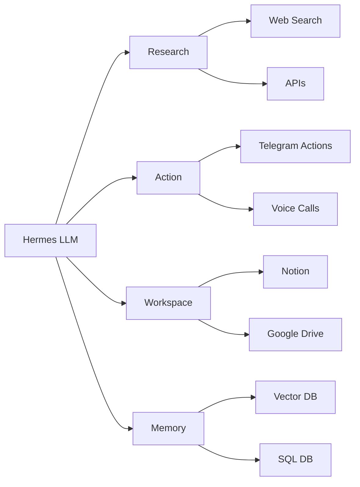

# Turning Hermes into a Superagent: 12 Essential Integrations for AI Agents  

## Overview  
This course teaches how to transform the Hermes Telegram‑based LLM into a fully capable AI Superagent by connecting twelve purpose‑built integrations. You will learn the four core jobs every useful agent must perform—Research, Action, Workspace, and Memory—and which tools satisfy each job. The material walks you through real‑world workflows that chain multiple integrations together, demonstrates a ten‑minute plug‑in process, and highlights the productivity gains that emerge when an agent gains senses, limbs, and long‑term memory. By the end of the course you will be able to configure Hermes to run autonomous tasks such as scanning inboxes, placing phone calls, analyzing Stripe data, and generating daily business dashboards without manual intervention.  

## Background & Context  
Large language models are powerful conversationalists but remain isolated “brains in a jar” when they lack access to external data sources and the ability to act in the world. Ole Lehmann (@itsolelehmann) observed that Hermes, despite being a competent chatbot, felt underwhelming until he began plugging in integrations that gave it eyes, ears, hands, voice, and memory. The concept mirrors the idea of an agent as a biological organism: a brain needs senses to perceive the environment and limbs to affect it. In the broader AI landscape, frameworks such as AutoGPT, LangChain agents, and MCP (Model Context Protocol) aim to solve the same problem—providing LLMs with tool use and stateful memory. Hermes distinguishes itself by operating inside Telegram, making the plug‑in process conversational: you ask the agent how to connect a service, and it guides you through OAuth, API keys, or MCP configuration in the same chat. The statistics attached to the original post—11 likes, 31 retweets, 332 replies, 81 K views, 910 “relevant” interactions, and a newsletter reaching 37 k subscribers—illustrate strong community interest in practical agent engineering.  

## Core Concepts  

### Hermes  
Hermes is a Telegram‑based interface to a large language model (functionally comparable to Claude or ChatGPT) that allows users to interact with the model via chat. Out of the box, Hermes can answer questions, generate text, and hold conversations, but it cannot access personal data, browse the web, or perform actions outside the chat window. The platform’s strength lies in its conversational UI, which makes the process of adding integrations feel natural: you simply ask Hermes how to connect a tool, and it returns step‑by‑step instructions.  

### Superagent  
A Superagent is an LLM that has been augmented with a suite of integrations granting it perception (senses), actuation (limbs), and persistent memory. When Hermes is equipped with the twelve integrations discussed in the source, it evolves from a passive chatbot into an autonomous coworker that can anticipate needs, execute multi‑step workflows, and surface insights without explicit prompting. The transformation is noticeable when the agent begins to run complex tasks overnight and presents a ready‑to‑act list the moment you unlock your phone.  

### Integrations as Senses and Limbs  
Integrations are the modular connections that give an agent the ability to perceive external data (eyes, ears) and to affect the world (hands, voice). Each integration maps to a specific capability:  
- **Firecrawl** provides enhanced web search, returning cleaner data with lower token usage than Hermes’ native search.  
- **Reddit** streams real‑time community sentiment, acting as the agent’s ear to the streets.  
- **YouTube transcripts** convert video captions into searchable notes, unlocking knowledge from long‑form content.  
- **Browserbase** offers full browser automation, enabling login, button clicks, and navigation past anti‑scraper measures.  
- **Bland** (or Twilio) supplies a programmable voice channel, allowing the agent to place and receive phone calls.  
- **Stripe** gives direct access to payment data, customer records, failed charges, and refunds, effectively putting “eyes on your business.”  
- **Google Workspace** bundles Gmail, Calendar, Drive, Docs, and Sheets into a single connector, essential for any agent that must read or write inside a user’s productivity suite.  
- **Discord** enables the agent to post messages, monitor channels, and automate community‑management tasks.  
- **GitHub** provides access to repositories, issues, and pull requests, turning the agent into an engineering teammate.  
- **Readwise** aggregates highlights from books, articles, tweets, and podcasts into a queryable store, solving the “dead knowledge” problem.  
- **Granola** creates searchable transcripts of every meeting, letting the agent recall spoken details instantly.  
- **Obsidian** functions as a personal knowledge vault; when linked, Hermes can traverse the entire note network and surface forgotten connections.  

### The Four Jobs of a Useful Agent  
Every effective Hermes setup must satisfy four functional categories. Missing any one leaves the agent “blind” in that dimension.  

**Job 1: Research (eyes and ears on the world)**  
This job equips the agent to gather information autonomously. Firecrawl delivers fast, token‑efficient web search. Reddit supplies unfiltered community opinions, useful for idea validation. YouTube transcripts turn video content into searchable text, enabling the agent to extract insights from podcasts, tutorials, and conference talks without watching them.  

**Job 2: Action (hands and voice in the world)**  
Here the agent moves beyond description to execution. Browserbase lets Hermes interact with websites that require authentication or dynamic JavaScript. Bland/Twilio gives the agent a voice to place live calls—useful for booking reservations or confirming appointments. Stripe enables the agent to query payment data, identify churn reasons, and eventually execute agentic payments directly from a user’s card.  

**Job 3: Workspace (where you actually live)**  
This job integrates the agent into the user’s daily productivity environment. Google Workspace is the foundational connector; without it the agent cannot read email, schedule events, or edit documents. Discord allows the agent to operate inside community channels, automating support triage or announcements. GitHub grants the agent the ability to open pull requests, review code, and triage issues, making it a true engineering partner.  

**Job 4: Memory (the long‑term brain)**  
Persistent memory prevents the agent from forgetting past interactions. Readwise imports all highlights, turning scattered PDFs and saved tweets into a searchable repository. Granola records and indexes meeting transcripts, so the agent can answer questions like “What did that client say about pricing last month?” Obsidian, when used as a second brain, lets Hermes traverse a personal wiki and surface connections between ideas that the user may have forgotten.  

### Chaining Integrations  
When integrations operate in isolation, each provides a useful but limited capability. True power emerges when they are chained together, allowing the output of one tool to become the input of another. For example, the sponsor filter workflow uses Firecrawl to scrape a sponsor’s website, Reddit and YouTube to gauge public sentiment, and then posts a one‑page fit rating to Discord. The Monday business dashboard pulls revenue data from Stripe, follower metrics from X and LinkedIn via Browserbase, and posts a week‑over‑week comparison in Discord. None of these workflows are feasible with a single integration; they require at least three or four tools communicating.  

### Plug‑In Process (10‑Minute Method)  
The source outlines a rapid, conversational method for adding integrations:  

1. **Ask Hermes how to connect a tool.**  
   Example prompt: `Hey Hermes, I want to connect my Gmail. What do I need?`  
   Hermes replies with the required steps—OAuth flow, API key generation, or MCP configuration—all within the same chat thread.  

2. **Test the connection.**  
   Pose a question that can only be answered if the integration is live:  
   - `What's on my calendar today?` (Google Workspace)  
   - `Find the last email from that client about the contract.` (Gmail)  
   - `Pull the last 5 failed Stripe charges.` (Stripe)  
   A clean, accurate response confirms the integration is functional.  

3. **Stack the integrations.**  
   Begin with two tools to see immediate utility (e.g., Gmail + Calendar yields a chatbot with inbox context). Continue adding favorites until you have twelve connected. Once stacked, ask Hermes to perform a task it could not do an hour prior—such as generating a sponsor filter report or launching a support‑ticket triage. The moment the agent executes the request autonomously, the chatbot “dies” and the Superagent emerges.  

### Token Efficiency and MCP  
Firecrawl is highlighted as a token‑saving alternative to Hermes’ native search because it returns structured, concise results, reducing the number of tokens the LLM must process. The plug‑in process often relies on the Model Context Protocol (MCP), a standardized way for agents to discover and invoke tools. When Hermes mentions “MCP” during the connection walkthrough, it is referring to this protocol, which enables seamless tool discovery without custom code for each service.  

### Real‑World Workflow Examples  
The source provides three concrete, chained workflows that illustrate the Superagent’s capabilities:  

**The Sponsor Filter**  
When a sponsorship inquiry arrives via DM on X or email, Hermes:  
1. Reads the message.  
2. Scrapes the sponsor’s website using Firecrawl.  
3. Scans Reddit and YouTube for organic chatter about the sponsor.  
4. Synthesizes a one‑page fit rating and posts it to a designated Discord channel.  

**The Customer Support Agent**  
Each morning Hermes:  
1. Scans Gmail for new support emails.  
2. Categorizes each email by issue type (e.g., billing, bug, feature request).  
3. Logs each ticket in a Discord support channel with priority tags.  
4. Weekly, it posts a summary to Obsidian highlighting the five recurring problems that deserve root‑cause fixes.  

**The Monday Business Dashboard**  
At 8 am every Monday Hermes:  
1. Pulls revenue, new subscriptions, refunds, and churn from Stripe.  
2. Uses Browserbase to scrape follower growth and post view counts from X and LinkedIn.  
3. Composes a week‑vs‑last‑week breakdown and posts it to Discord.  
The user can read the update in ten seconds instead of spending an hour hopping between dashboards.  

## How It Works / Step‑by‑Step  

### Step 1: Initiate Connection via Conversational Prompt  
Open Hermes in Telegram. Type a request that names the target tool and asks for connection instructions. The agent will respond with a detailed guide that may include:  
- Opening an OAuth consent screen (for Google Workspace, Discord, etc.).  
- Generating an API key from the service’s developer portal (for Stripe, Firecrawl, Bland).  
- Configuring an MCP endpoint if the tool supports the Model Context Protocol.  
All instructions appear in the same chat, eliminating the need to switch contexts.  

### Step 2: Validate with a Targeted Query  
After following the provided steps, test the integration by asking a question that requires live data from that tool. Examples:  
- **Calendar:** `What's on my calendar today?` → Hermes should list today’s events.  
- **Gmail:** `Find the last email from that client about the contract.` → Hermes should return the exact message thread.  
- **Stripe:** `Pull the last 5 failed Stripe charges.` → Hermes should output a list with amounts, dates, and reasons.  
If the answer is accurate and sourced from the tool, the integration is live. If Hermes falls back to its internal knowledge or says it cannot access the data, repeat the connection steps.  

### Step 3: Stack and Chain  
Begin with a pair of integrations that solve a immediate need (e.g., Google Workspace + Discord for email‑to‑Discord forwarding). Verify each works independently, then construct a simple chain:  
1. Hermes receives an email.  
2. It extracts the sender and subject.  
3. It posts a formatted message to a Discord channel.  
Once comfortable, add additional tools to build more complex workflows. The source emphasizes that twelve connected integrations enable the agent to run autonomous, multi‑step processes overnight, delivering ready‑to‑act insights each morning.  

### Step 4: Deploy Autonomous Workflows  
With the stack in place, invoke a workflow by asking Hermes to perform the end‑to‑end task. For the sponsor filter, you might say:  
`Hey Hermes, run the sponsor filter on the latest DM I received about a potential partnership.`  
Hermes will then: read the DM, invoke Firecrawl, query Reddit and YouTube, synthesize the rating, and post to Discord—all without further prompting.  

## Real‑World Examples & Use Cases  

### Sponsor Filter Workflow (Detailed)  
1. **Trigger:** A direct message arrives on X or an email lands in Gmail containing a sponsorship proposal.  
2. **Reading:** Hermes uses the Google Workspace integration to parse the message content and extract the sender’s name, company, and any URLs.  
3. **Website Scrape:** Firecrawl is called with the extracted URL; it returns the homepage text, meta description, and key product details while consuming fewer tokens than a native search.  
4. **Community Sentiment:** Reddit is queried for the company name or product keywords; the agent pulls recent comments and upvote/downvote ratios. YouTube transcripts are fetched for any official or review videos, providing timestamped excerpts.  
5. **Synthesis:** Hermes combines the scraped website data, Reddit sentiment, and YouTube highlights into a concise one‑page brief that includes a fit rating (e.g., “High fit – audience aligns with product”).  
6. **Output:** The brief is posted to a predefined Discord channel where the user’s team reviews sponsorship opportunities.  

### Customer Support Agent Workflow (Detailed)  
1. **Inbox Scan:** At 6 am Hermes queries Gmail via the Google Workspace connector for messages labeled “support” or received after the previous day’s scan.  
2. **Categorization:** Using natural language understanding, Hermes tags each email with an issue type (billing, technical bug, feature request, etc.) and assigns a priority based on keywords and sender history.  
3. **Discord Logging:** For each ticket, Hermes posts a message to a Discord support channel containing: ticket ID, sender, summary, issue type, priority, and a link to the original email in Gmail.  
4. **Weekly Summary:** Every Sunday at 8 pm Hermes aggregates the week’s tickets, counts occurrences per issue type, identifies the top five recurring problems, and writes a markdown note to Obsidian titled “Weekly Support Summary – YYYY‑MM‑DD.”  
5. **Outcome:** The user gains a continuously updated support queue in Discord and a searchable knowledge base of recurring issues in Obsidian, enabling proactive product improvements.  

### Monday Business Dashboard Workflow (Detailed)  
1. **Stripe Pull:** Hermes calls the Stripe integration to retrieve: total revenue, new subscriptions, refunds issued, and churn rate for the preceding week.  
2. **Social Metrics via Browserbase:**  
   - Hermes launches a headless browser through Browserbase, logs into X (if required), navigates to the user’s profile, and extracts follower count and total post impressions.  
   - It repeats the process for LinkedIn, pulling follower growth and post view metrics.  
3. **Calculation:** The agent computes week‑over‑week percentage changes for each metric.  
4. **Formatting:** A concise markdown table is assembled, e.g.:  

| Metric

<!-- auto-diagram -->

