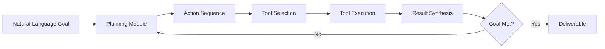

# DeerFlow: ByteDance's Open-Source AI Agent for Autonomous Task Execution  

## Overview  
This course explores DeerFlow, the open‑source AI agent released by ByteDance (the parent company of TikTok) that moves beyond conversational chatbots to perform real‑world work autonomously. You will learn how a single natural‑language goal—such as “build me a research report with charts”—is transformed into a complete deliverable through planning, tool use, and synthesis. The material covers the agent’s architecture, its distinction from traditional LLMs, practical steps for deployment, and concrete use‑case scenarios. By the end, you will understand how to leverage DeerFlow‑style agents to automate knowledge‑intensive tasks in research, business, and software development.  

## Background & Context  
The rise of large language models (LLMs) has produced powerful conversational interfaces, yet most of these systems remain limited to generating text in response to prompts without taking concrete actions in external environments. Researchers and engineers have long sought to close this gap by augmenting LLMs with planning modules, memory, and tool‑use capabilities, giving rise to the concept of **AI agents**—systems that perceive a goal, devise a sequence of actions, execute those actions using available tools, and iteratively refine their output until the goal is satisfied.  

ByteDance, recognizing the strategic value of moving from passive chat to active work, invested in an internal project that eventually became DeerFlow. The company open‑sourced the agent in early 2024 to accelerate community innovation, lower the barrier for enterprises to adopt autonomous workflows, and showcase its AI research leadership alongside its social‑media empire. The release coincided with a growing trend of “agentic” frameworks such as AutoGPT, BabyAGI, and LangChain‑based agents, but DeerFlow distinguishes itself by focusing on **end‑to‑end deliverable generation** rather than merely chaining LLM calls.  

The source tweet highlights the core promise: a user supplies a single, high‑level goal, and DeerFlow “builds the whole thing.” The example given—creating a research report complete with charts—illustrates the agent’s ability to gather information, analyze data, produce visualizations, and format a polished document without further human intervention. This capability addresses a persistent pain point in knowledge work: the manual, time‑consuming steps of literature review, data extraction, analysis, and report composition. By automating these steps, DeerFlow aims to free professionals to focus on higher‑order interpretation and decision‑making.  

From a broader landscape perspective, DeerFlow sits at the intersection of three technological currents: (1) the scaling of foundation models that enable sophisticated reasoning, (2) the maturation of tool‑integration ecosystems (e.g., APIs for web search, code execution, data visualization), and (3) the open‑source movement that democratizes access to cutting‑edge AI. Understanding DeerFlow therefore provides insight into where the next wave of productivity‑enhancing AI is headed and how organizations can prepare to integrate agentic systems into their workflows.  

## Core Concepts  

### DeerFlow Overview  
DeerFlow is an open‑source AI agent framework developed by ByteDance that accepts a single natural‑language goal and autonomously produces a tangible artifact—such as a report, slide deck, prototype, or data analysis—without requiring iterative prompting. Unlike conventional chatbots that rely on turn‑by‑turn user guidance, DeerFlow internally loops through planning, execution, and evaluation phases until it judges the goal satisfied. The framework is released under a permissive license, allowing researchers and developers to inspect, modify, and extend its components. Core components include a goal interpreter, a planner that decomposes the goal into sub‑tasks, a tool‑use module that invokes external services (web search, code execution, charting libraries), a memory system for tracking intermediate results, and a synthesizer that assembles the final output. The design emphasizes **reliability** and **traceability**, logging each step so users can audit how the agent arrived at its conclusion.  

### Goal‑Driven AI Agent  
A goal‑driven AI agent differs from a prompt‑driven LLM in that the primary input is a **desired outcome** rather than a question or instruction for immediate text generation. The agent must infer the necessary steps to achieve that outcome, often dealing with ambiguity, incomplete information, and evolving constraints. In DeerFlow, the goal interpreter first parses the user’s utterance into a structured goal object containing fields such as *objective* (e.g., “produce a research report”), *required deliverables* (e.g., “include charts”), *domain constraints* (e.g., “use recent peer‑reviewed sources”), and *quality criteria* (e.g., “APA citation style”). This structured representation enables the planner to search a space of possible workflows, select one that maximizes expected utility, and adapt if execution fails. The goal‑driven paradigm shifts the interaction model from **question answering** to **task completion**, aligning AI behavior more closely with human project management.  

### Autonomous Task Execution vs Conversational AI  
Conversational AI systems excel at maintaining dialogue, clarifying intent, and generating coherent text, but they typically halt after each response, awaiting the next user prompt. Autonomous task execution, as embodied by DeerFlow, continues operating **without** further user input until a termination condition is met. This requires the agent to possess: (1) **self‑directed planning**—the ability to break a high‑level goal into ordered sub‑goals; (2) **tool proficiency**—knowing when and how to call external APIs, run code, or manipulate files; (3) **state tracking**—maintaining a working memory of what has been accomplished and what remains; and (4) **self‑evaluation**—judging whether current output satisfies the goal’s success criteria. When any of these components falters, the agent can invoke fallback strategies such as replanning, requesting clarification (if configured), or escalating to a human supervisor. The result is a system that can undertake multi‑hour knowledge‑work projects with minimal supervision.  

### Open Source Release by ByteDance  
ByteDance’s decision to open‑source DeerFlow reflects a strategic balance between protecting core proprietary advantages (e.g., recommendation algorithms) and fostering ecosystem growth in the agent space. By publishing the codebase under an MIT‑compatible license, the company enables academic researchers to study agent safety, alignment, and scalability; it allows startups to build vertical solutions (e.g., automated financial reporting) without reinventing the core loop; and it invites contributions that improve robustness, add new tool integrations, or enhance the planner’s efficiency. The repository includes Dockerfiles for reproducible deployment, a set of example workflows (research report generation, market analysis, code prototyping), and a benchmark suite that measures success rates on varied goal types. This openness accelerates community‑driven innovation while giving ByteDance visibility and talent attraction in the competitive AI‑agent arena.  

### Output Generation: Reports and Visualizations  
The tweet’s concrete example—“build me a research report with charts”—illustrates DeerFlow’s capacity to produce **multimodal deliverables** that combine narrative text, data tables, and visual graphics. To achieve this, the agent must: (i) locate relevant sources via web search or academic APIs; (ii) extract and structure pertinent facts; (iii) perform any necessary quantitative analysis (e.g., computing averages, trends, statistical significance); (iv) generate charts using libraries such as Matplotlib, Seaborn, or Plotly; (v) embed those charts into a document format (e.g., Markdown, LaTeX, or Word) with appropriate captions and references; and (vi) apply formatting rules (headings, bibliography style, page layout). The synthesizer module handles the final assembly, ensuring that the output adheres to any user‑specified style guide. Because each step is logged, users can trace a chart back to the underlying data source and the exact transformation applied, enhancing trust and reproducibility.  

## How It Works / Step-by-Step  
DeerFlow operates through a cyclic architecture that can be described in five high‑level stages: **Goal Interpretation, Planning, Tool‑Enabled Execution, State Update, and Termination Check**.  

1. **Goal Interpretation** – The raw user string is passed to a language model fine‑tuned for intent parsing. The model outputs a JSON‑like goal specification:  
   ```json  
   {  
     "objective": "research report",  
     "topic": "impact of remote work on employee productivity",  
     "required_elements": ["introduction", "literature review", "methodology", "results", "charts", "conclusion", "references"],  
     "style_guide": "APA",  
     "depth": "graduate-level",  
     "success_criteria": ["minimum 8 sources", "at least 2 charts", "coherent narrative"]  
   }  
   ```  
   This step resolves ambiguities (e.g., clarifying what “charts” means) and establishes concrete success metrics.  

2. **Planning** – A planner (often a tree‑search or LLM‑based reasoning module) takes the goal spec and decomposes it into an ordered list of actionable sub‑tasks. For the research‑report example, a plausible plan might be:  
   - Search recent literature (2022‑2024) on remote work productivity.  
   - Extract key findings and quantitative metrics from each source.  
   - Store extracted data in a temporary CSV.  
   - Perform descriptive statistics (mean, median, variance) and compute correlation between remote‑work hours and self‑reported productivity.  
   - Generate a bar chart of average productivity by industry and a scatter plot of hours vs. productivity.  
   - Write each report section, inserting citations and chart placeholders.  
   - Compile the Markdown file, convert to PDF, and verify against success criteria.  
   The planner also estimates resource costs (API calls, compute time) and may prune low‑value branches.  

3. **Tool‑Enabled Execution** – Each sub‑task is dispatched to the appropriate tool module:  
   - **Web Search Tool**: calls SerpAPI or Bing Search API, retrieves top‑k results, extracts snippets.  
   - **HTML Parser**: cleans raw HTML, isolates main article text.  
   - **Data Extraction Tool**: uses regex or LLM‑based entity recognition to pull numbers, percentages, study designs.  
   - **Analysis Tool**: runs a Python script in a sandboxed environment; imports pandas, numpy, scipy for stats.  
   - **Charting Tool**: invokes Matplotlib to create figures, saves them as PNG/SVG.  
   - **Writing Tool**: stitches together sections using a Jinja2 template, inserts chart paths, formats citations via citeproc.  
   All tool calls are logged with timestamps, inputs, and outputs, enabling replay and debugging.  

4. **State Update** – After each tool execution, the agent updates its internal memory:  
   - Accumulated facts are stored in a knowledge graph (subject‑predicate‑object triples).  
   - Intermediate files (CSV, charts) are referenced by UUID.  
   - A progress tracker marks completed sub‑tasks and notes any failures (e.g., a chart generation error due to missing data).  
   If a failure is detected, the planner may invoke a **repair sub‑task** (e.g., try an alternative data source, adjust chart parameters).  

5. **Termination Check** – The agent evaluates whether the current state satisfies the success criteria defined in the goal spec. It checks:  
   - Presence of all required sections.  
   - Minimum number of sources and charts.  
   - Adherence to style guide (via a lightweight validator).  
   If criteria are met, the loop exits and the final artifact is returned to the user. If not, the agent returns to the planning stage, possibly with revised sub‑tasks based on what is missing.  

This loop continues until either success is achieved or a maximum iteration limit is reached, at which point the agent returns the best‑effort output along with a diagnostic report.  

## Real-World Examples & Use Cases  
The source tweet’s explicit example—generating a research report with charts—serves as a foundational use case, but DeerFlow’s architecture supports a broad spectrum of knowledge‑intensive tasks.  

**Academic Research Assistance** – A graduate student could issue the goal: “produce a literature review on transformer‑based vision models, including a table comparing accuracy across benchmarks and a timeline of key papers.” DeerFlow would automatically query arXiv, Semantic Scholar, and IEEE Xplore, extract performance numbers, generate a comparative table, plot a chronological citation network, and assemble a formatted review manuscript ready for submission to a workshop.  

**Business Intelligence Reporting** – An analyst might request: “create a quarterly market‑share report for the electric‑vehicle sector in Europe, with bar charts of sales by manufacturer and a line chart of growth trends.” The agent would pull data from public filings, industry databases (e.g., EV-Volumes), clean and normalize the figures, compute year‑over‑year percentages, render the visualizations, and embed them in a PowerPoint‑compatible Markdown deck.  

**Software Prototyping** – A developer could say: “build a simple REST API in Python Flask that manages a TODO list, includes unit tests, and provides a Swagger documentation page.” DeerFlow would scaffold the project directory, write the Flask app, generate pytest cases, run the tests to verify correctness, produce an OpenAPI spec, and zip the whole repository for immediate use.  

**Legal Document Drafting** – A lawyer might ask: “draft a non‑disclosure agreement (NDA) for a software‑development partnership, governing law California, with clauses on confidentiality, term, and remedies.” The agent would retrieve template clauses from trusted legal repositories, adapt them to the specified jurisdiction, assemble a coherent contract, and output a PDF ready for review.  

**Educational Content Creation** – An instructor could request: “prepare a slide deck explaining the Central Limit Theorem, with intuitive visual simulations and a quiz slide.” DeerFlow would run a Python simulation that samples from various distributions, plots the resulting sampling distributions, captures the frames as images, inserts them into slides, and adds multiple‑choice questions based on the simulation outcomes.  

These scenarios illustrate how shifting from a chat‑oriented interaction to a goal‑oriented, autonomous workflow can reduce the manual overhead of information gathering, synthesis, and formatting, allowing professionals to focus on interpretation, strategy, and creative problem‑solving.  

## Key Insights & Takeaways  
- DeerFlow transforms a single natural‑language goal into a complete, polished artifact by iterating through planning, tool use, and self‑evaluation without further user prompting.  
- The agent’s strength lies in its modular tool ecosystem, enabling it to perform web search, data analysis, code execution, and chart generation as needed to satisfy complex goals.  
- Open‑sourcing by ByteDance provides a transparent, extensible foundation for researchers and developers to experiment with agent safety, alignment, and scalability.  
- Unlike conversational LLMs that stop after each response, DeerFlow maintains an internal state and continues working until predefined success criteria are met.  
- The system logs every intermediate step, offering traceability that is crucial for auditing, debugging, and building trust in autonomous outputs.  
- Goal specification is critical: clear, detailed objectives (including required elements, style guides, and quality thresholds) dramatically improve the agent’s likelihood of success on the first attempt.  
- DeerFlow excels at multimodal deliverables that combine narrative, tabular data, and visualizations, making it suitable for reports, presentations, and technical documentation.  
- The planner’s ability to detect failures and invoke repair sub‑tasks adds robustness, allowing the agent to recover from missing data or tool errors without human intervention.  
- By automating the labor‑intensive stages of information gathering and synthesis, DeerFlow frees users to allocate cognitive effort toward higher‑order analysis and decision‑making.  
- The framework’s permissive licensing encourages community contributions, which can expand the toolset (e.g., adding APIs for specialized databases or domain‑specific solvers) and improve overall performance.  

## Common Pitfalls / What to Watch Out For  
- **Vague Goal Statements**: If the user supplies an ambiguous goal (e.g., “make me a report”), the planner may generate irrelevant or incomplete outputs; always specify required sections, data types, and success criteria.  
- **Tool Misconfiguration**: DeerFlow relies on external APIs (search, code execution); missing API keys or rate‑limit errors can cause silent failures—verify that all needed services are accessible and properly authenticated.  
- **Data Quality Issues**: The agent will faithfully incorporate whatever information it retrieves; erroneous or biased source material can propagate into the final report, so consider post‑generation validation for high‑stakes domains.  
- **Over‑Reliance on Automation**: Fully trusting the agent’s output without human review can lead to subtle mistakes (e.g., mislabeled axes in a chart); treat DeerFlow as a drafting assistant that still requires expert oversight.  
- **Resource Consumption**: Complex goals may trigger numerous API calls and lengthy compute runs, potentially incurring costs or hitting usage limits; monitor resource usage and set reasonable iteration caps.  
- **Safety and Alignment Gaps**: While the open‑source release includes basic safety filters, the agent could inadvertently generate disallowed content if prompted with malicious goals; apply additional moderation layers when deploying in public‑facing contexts.  
- **Version Drift**: As community contributors add new tools or modify the planner, older workflows may behave differently; pin dependencies and test critical pipelines after updates.  
- **Interpretability Limits**: Although steps are logged, the internal reasoning of the LLM‑based planner can remain opaque; for compliance‑heavy use cases, supplement with external auditing or explainability tools.  

## Review Questions  
1. Explain how DeerFlow’s goal‑driven architecture differs from a traditional prompt‑to‑response LLM interaction, focusing on the role of internal planning and state tracking.  
2. Describe the complete execution loop DeerFlow follows when tasked with “build me a research report with charts,” including how the agent decides when the task is finished.  
3. Imagine you need to use DeerFlow to generate a market‑analysis slide deck for a new product launch. List the specific sub‑tasks the planner would likely produce, the tools each sub‑task would invoke, and the success criteria you would define to ensure the deck meets professional standards.  

## Further Learning  
- Study foundational works on AI agents such as “ReAct: Synergizing Reasoning and Acting in Language Models” (Yao et al., 2022) and “Toolformer: Language Models Can Teach Themselves to Use Tools” (Schick et al., 2023) to understand the reasoning‑tool integration that underlies DeerFlow.  
- Explore the official DeerFlow GitHub repository to examine the planner implementation, tool interfaces, and example workflows; try running the provided research‑report demo on your own machine.  
- Investigate complementary agent frameworks like LangChain Agents, AutoGPT, and BabyAGI to compare different approaches to goal decomposition, memory management, and tool orchestration.  
- Learn about prompt engineering techniques for goal specification—how to articulate objectives, constraints, and evaluation metrics clearly to maximize agent success.  
- Read up on AI safety and alignment for autonomous systems, particularly papers on “AI Agents and the Problem of Unintended Side Effects” (Hadfield-Menell et al., 2017) and “Concrete Problems in AI Safety” (Amodei et al., 2016), to anticipate risks when deploying agents like DeerFlow in real‑world settings.  
- Practice extending DeerFlow with new tools: add a connector to a proprietary data warehouse, integrate a code‑formatting tool like Black, or plug in a diagram‑generation library such as Mermaid to broaden the range of deliverables the agent can produce.  
- Consider enrolling in courses or workshops on LLM‑based application development (e.g., “Building LLM‑Powered Applications” by DeepLearning.AI) to gain hands‑on experience with the libraries and patterns that make agents like DeerFlow possible.

<!-- auto-diagram -->

