# Turning Your Hermes Agent into a Smooth Operatin’ Mofo: Mastering AI Agent Personality and Functionality  

## Overview  
This course walks you through the exact template shared by @tonysimons_ for elevating a Hermes Agent from a basic conversational bot to a polished, effective AI agent that feels like a “smooth operatin’ mofo.” You will learn why personality matters in AI agents, how to embed it systematically, and what practical steps turn a generic agent into one that reliably delivers value while exhibiting charm, consistency, and purpose. By the end, you will have a ready‑to‑use blueprint you can bookmark, steal, and tweak for any Hermes‑based agent you build or maintain.  

## Background & Context  
AI agents have moved beyond simple rule‑based chatbots; they now combine large language models (LLMs), memory systems, tool use, and goal‑directed planning. Yet many agents feel mechanical or forgettable because their design focuses solely on capability, neglecting the human‑centric layer of personality that drives trust, engagement, and brand alignment. The Hermes Agent referenced in the tweet is a concrete implementation—often built on frameworks like LangChain, AutoGPT, or custom agent loops—that provides a scaffold for reasoning, tool invocation, and state management. The author’s “template” is a concise, repeatable pattern for injecting a rich, consistent personality into that scaffold without sacrificing performance. Understanding this template helps developers avoid the common pitfall of treating personality as an afterthought or as a superficial veneer, instead integrating it into the agent’s core prompt, memory, and decision‑making loops.  

## Core Concepts  

### Hermes Agent  
A Hermes Agent is a modular AI agent architecture that separates concerns into distinct layers: perception (input handling), cognition (reasoning/planning), memory (short‑term and long‑term storage), action (tool use), and expression (output generation). The cognition layer typically employs a loop where the agent receives a prompt, queries an LLM for a plan, executes the plan via available tools, observes results, and updates its internal state before repeating. This structure enables the agent to handle multi‑step tasks, maintain context across turns, and adapt to new information. In practice, a Hermes Agent might be instantiated with a base system message that defines its role, a set of APIs (e.g., web search, calculator, email), and a vector store for long‑term memory. The agent’s “soul” lies not in the underlying LLM but in how these components are orchestrated and guided by a well‑crafted personality template.  

### The Template  
The template presented in the tweet is a fill‑in‑the‑blank system prompt that surrounds the agent’s core instructions with personality‑defining statements. It consists of three blocks: (1) a **role definition** that tells the agent who it is (e.g., “You are Hermes, a witty and reliable personal assistant”), (2) a **behavioral guideline** that outlines how the agent should act (e.g., “Always respond with confidence, a touch of humor, and concise clarity”), and (3) a **value reminder** that reinforces the agent’s purpose (e.g., “Your goal is to make the user’s life easier while leaving them smiling”). By placing these blocks before the standard task‑specific instructions, the template ensures that every LLM call is conditioned on the same personality cues, leading to consistent tone and demeanor across interactions.  

### Smooth Operatin’ Mofo  
“Smooth operatin’ mofo” is a colloquial way of describing an agent that operates flawlessly, feels natural to interact with, and leaves a strong positive impression. Smoothness derives from three attributes: **predictability** (the agent behaves as expected given its personality), **fluidity** (transitions between topics or tool uses are seamless), and **impact** (the user achieves their goal while enjoying the interaction). In technical terms, smooth operation is achieved when the personality template does not conflict with the agent’s reasoning capabilities, when memory retrieval augments rather than distracts, and when tool outputs are integrated into the narrative voice defined by the template. The result is an agent that users perceive as competent, likable, and reliable—qualities that translate into higher retention, better task success rates, and stronger brand affinity.  

## How It Works / Step‑by‑Step  
1. **Define the Agent’s Core Role** – Begin by writing a concise role statement that captures the agent’s primary function and the persona you want it to embody. Example: “You are Hermes, a knowledgeable and slightly sarcastic research assistant who loves turning complex topics into bite‑size insights.” Place this statement at the very top of the system prompt.  
2. **Specify Behavioral Guidelines** – List 3‑5 bullet‑style directives that describe tone, style, and interaction norms. Use affirmative language (“Always…”, “Never…”) to avoid ambiguity. Example bullets:  
   - Always greet the user by name if known.  
   - Inject a light‑hearted metaphor when explaining a technical concept.  
   - Keep responses under three sentences unless the user asks for depth.  
   - When uncertain, admit the limitation and suggest a concrete next step.  
   - End each reply with an open‑ended question to encourage continuation.  
3. **Anchor the Agent’s Purpose** – Add a closing reminder that ties personality to the agent’s mission. This helps the LLM weigh personality against task completion. Example: “Your ultimate goal is to empower the user with clear, actionable knowledge while making the interaction enjoyable.”  
4. **Integrate with Existing Hermes Framework** – Insert the completed template before any task‑specific instructions or few‑shot examples you already have. If you use a LangChain `AgentExecutor`, you would modify the `agent` prompt like so:  
   ```python
   from langchain import PromptTemplate, LLMChain
   from langchain.llms import OpenAI

   template = """
   You are Hermes, a knowledgeable and slightly sarcastic research assistant who loves turning complex topics into bite‑size insights.
   Always greet the user by name if known.
   Inject a light‑hearted metaphor when explaining a technical concept.
   Keep responses under three sentences unless the user asks for depth.
   When uncertain, admit the limitation and suggest a concrete next step.
   End each reply with an open‑ended question to encourage continuation.
   Your ultimate goal is to empower the user with clear, actionable knowledge while making the interaction enjoyable.

   {agent_scratchpad}
   """
   prompt = PromptTemplate(input_variables=["agent_scratchpad"], template=template)
   llm_chain = LLMChain(llm=OpenAI(temperature=0.7), prompt=prompt)
   # ... rest of agent setup (tools, memory, etc.)
   ```
5. **Test and Iterate** – Run the agent through a variety of scenarios (simple Q&A, multi‑step tasks, ambiguous requests). Observe whether the personality shines through without compromising correctness. Adjust the template’s wording, temperature, or tool selection based on observed mismatches (e.g., if humor obscures clarity, reduce metaphor frequency).  
6. **Deploy with Monitoring** – Log both task success metrics (e.g., tool call accuracy, goal completion) and user‑experience signals (e.g., sentiment ratings, repeat usage). Use these logs to fine‑tune the template over time, ensuring the agent remains both smooth and effective.  

## Real‑World Examples & Use Cases  
**Customer Support Agent** – A Hermes Agent deployed for an e‑commerce site can use the template to adopt a friendly, upbeat tone (“Hey there! Let’s get that order sorted out with a sprinkle of optimism”). The behavioral guidelines might include: always apologize sincerely for any inconvenience, use emojis sparingly to convey warmth, and confirm understanding before proposing a solution. The purpose reminder keeps the agent focused on resolving tickets quickly while leaving the customer feeling heard.  

**Personal Learning Companion** – Imagine a Hermes Agent that helps users study for certification exams. The role statement frames it as a “patient mentor who loves turning dense material into memorable stories.” Guidelines encourage the use of analogies, occasional jokes related to the exam topic, and summarizing key points in a single sentence after each explanation. The purpose reminder emphasizes empowerment: “Your goal is to make the user feel confident and ready to ace the test.” In practice, the agent will retrieve relevant snippets from a vector store, craft explanations that follow the template, and invoke a quiz‑generation tool to reinforce learning—all while maintaining a consistent, engaging voice.  

**Content Creation Assistant** – For a marketing team, a Hermes Agent can be tuned to embody a “bold, witty brand voice that isn’t afraid to break the mold.” The template might instruct the agent to start each copy draft with a punchy hook, use active voice, and end with a call‑to‑action that feels like a friendly challenge. Behavioral guidelines could include: avoid jargon unless the audience expects it, keep sentences under 20 words for punchiness, and always include a brand‑specific tagline. The purpose reminder ties creativity to business outcomes: “Your goal is to produce copy that captures attention, drives clicks, and feels unmistakably ours.”  

## Key Insights & Takeaways  
- A well‑crafted personality template sits **outside** the variable task instructions, ensuring every LLM call is infused with the same tone and values.  
- The Hermes Agent architecture provides the necessary scaffolding (memory, tools, reasoning loops) for the template to act upon without being overwritten.  
- “Smooth operatin’ mofo” describes an agent whose behavior is predictable, fluid, and impactful—qualities that stem from aligning personality with capability, not from adding flair on top of a broken system.  
- Effective templates contain three essential layers: role definition, behavioral guidelines, and purpose reminder; omitting any layer leads to either blandness or inconsistency.  
- Personality should be **tested** alongside functional metrics; a funny agent that gives wrong answers is worse than a dull but accurate one.  
- Iterative refinement based on user feedback and logged interactions is crucial; the template is a living artifact, not a one‑time setup.  
- Tool outputs must be **re‑phrased** through the personality lens; raw data dumps break the smooth experience unless the agent rewrites them in its voice.  
- Consistency across turns is maintained by feeding the template into the agent’s scratchpad or system message each loop iteration, preventing drift.  
- The same template can be ported to different Hermes‑based implementations (LangChain, AutoGPT, custom loops) with only minor syntactic changes.  
- Ultimately, the template transforms the agent from a tool that merely answers questions into a partner that users enjoy working with, increasing adoption and satisfaction.  

## Common Pitfalls / What to Watch Out For  
- **Over‑loading the template** with too many contradictory traits (e.g., “be both formal and hilarious”) causes the LLM to vacillate, resulting in erratic tone.  
- **Ignoring token limits**; a verbose template can consume a large portion of the context window, leaving insufficient space for task‑specific details and leading to truncated reasoning.  
- **Separating personality from tool use**; if the agent inserts raw API responses without re‑phrasing them through its voice, the interaction feels robotic despite a lively prompt.  
- **Setting temperature too high** while relying on a strict template can cause the model to ignore the guidelines in favor of creative but off‑persona completions.  
- **Neglecting to update the template** when the agent’s role evolves (e.g., adding new capabilities) leads to outdated behavior that confuses users.  
- **Assuming the template alone guarantees smoothness**; underlying flaws in memory retrieval or tool selection will still produce frustrating experiences regardless of tone.  
- **Using the template as a substitute for proper prompt engineering**; the template works best when combined with clear few‑shot examples and well‑defined tool descriptions.  
- **Failing to test edge cases** such as ambiguous queries or user‑directed tone shifts; the agent may either over‑apply its personality or become unresponsive.  

## Review Questions  
1. Explain why placing the personality template **outside** of the variable task instructions is critical for maintaining consistent agent behavior across multiple turns.  
2. Describe the three‑step process for integrating the template into a Hermes Agent built with LangChain, including where the template appears in the prompt chain and how agent scratchpad variables are handled.  
3. Suppose you notice that your Hermes Agent’s jokes are making technical explanations harder to understand. Propose a concrete adjustment to the template or its usage that would preserve humor while improving clarity, and explain how you would validate the change.  

## Further Learning  
- Study **prompt engineering techniques** such as chain‑of‑thought, few‑shot exemplars, and self‑consistency to complement personality templates with stronger reasoning capabilities.  
- Explore **memory systems** for AI agents (vector stores, knowledge graphs, episodic memory) to understand how to retain and recall user‑specific information without breaking the agent’s voice.  
- Investigate **tool integration patterns** (API wrappers, function calling, plugin architectures) to ensure that external actions can be narrated smoothly through the agent’s personality.  
- Review **agent evaluation frameworks** (e.g., AgentBench, GAIA) that measure both task success and user‑experience metrics, enabling data‑driven refinement of templates like the one presented.  
- Look into **adaptive personality models** that dynamically adjust tone based on user sentiment or context, building on the static template approach to create even more responsive agents.

```mermaid
flowchart LR
    A[Define Core Purpose] --> B[Design Personality Traits]
    B --> C[Craft Tone & Language Style]
    C --> D[Embed Memory & Context]
    D --> E[Integrate Tools & APIs]
    E --> F[Implement Goal-Directed Loop]
    F --> G[Test for Consistency]
    G --> H[Refine Based on Feedback]
    H --> I[Deploy & Monitor]
    I --> J[Iterate Personality & Functionality]
```

<!-- auto-diagram -->

