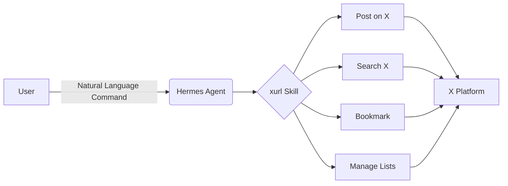

# Automating X Interactions with AI Agents using xurl

## Overview
This course covers how to utilize the xurl skill to enable an AI Agent, specifically the Hermes Agent, to read and write to X on your behalf. It demonstrates how natural language commands can be used to perform complex actions like posting, searching, and managing data on the platform.

## Key Concepts
- xurl skill: A specific tool/skill enabling interaction with the X platform.
- Hermes Agent: The AI Agent that utilizes the xurl skill.
- Natural Language Interface: The method used to command the agent (e.g., posting, searching) via plain language.
- X Automation: The ability to automate tasks on X, such as posting, bookmarking, and managing lists.

## Chapter 1: Introducing the xurl Skill
The xurl skill is a tool published by the xai team designed to bridge the gap between AI Agents and the X platform. This skill provides the necessary functionality for an agent to interact with X in a structured way.

## Chapter 2: Agent Capabilities via xurl
When integrated with an AI Agent like Hermes Agent, the xurl skill expands the agent's capabilities significantly. The agent gains the ability to perform diverse actions on X, including posting content, executing searches, pulling bookmarks, and managing lists.

## Key Takeaways
- The xurl skill allows AI Agents to read and write to X automatically.
- AI Agents, such as Hermes Agent, can execute complex tasks on X through natural language commands.
- Key functionalities include posting, searching, pulling bookmarks, and managing lists.
- This setup automates repetitive and complex interactions with the X platform.

## Review Questions
1. What is the primary function of the xurl skill in the context of an AI Agent?
2. Besides posting, what other specific actions can the Hermes Agent perform on X using this skill?

## Further Exploration
- Detailed setup guide for integrating the xurl skill with a specific AI framework.
- Exploring the ethical considerations and limitations of using AI agents for automated content posting on social media.

<!-- auto-diagram -->

