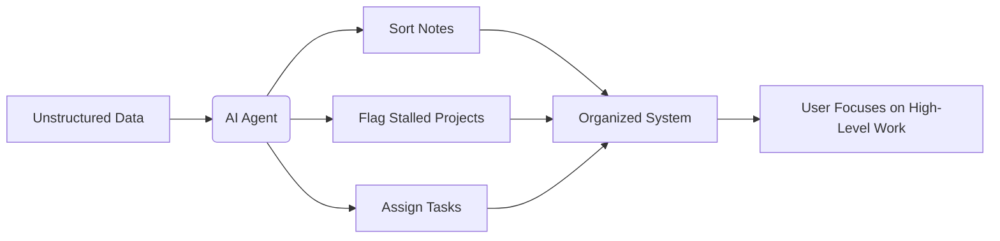

# How AI Agents Revolutionize Personal Productivity

## Overview
This course explores how AI Agents can automate complex organizational tasks, transforming the way individuals manage projects and maintain productivity. It demonstrates how a smart system can handle sorting, flagging, and assignment so users can focus on high-level work.

## Key Concepts
- AI Agents
- Automated Task Sorting
- Project Flagging
- Task Assignment
- Productivity System

## Chapter 1: The Challenge of Manual Organization
Traditional task management often requires significant manual effort, such as dumping information into folders and manually tracking stalled projects. This manual process is time-consuming and often leads to missed deadlines and disorganized workflows.

## Chapter 2: The Automated Solution
AI Agents provide a solution by automatically processing vast amounts of unstructured data. They can analyze notes, sort information, flag stalled projects, and assign necessary tasks, creating an organized system without constant manual intervention.

## Key Takeaways
- AI Agents can automatically sort notes and organize all information.
- Systems can proactively flag stalled projects, alerting users to areas needing attention.
- Task assignment can be handled automatically, streamlining workflow management.
- Automation frees up time previously spent on manual organization.
- The goal of AI agents is to ensure that "everything is still on track" effortlessly.

## Review Questions
1. What is the primary benefit of using an AI Agent for personal task management?
2. How does the automation of sorting and flagging improve an individual's productivity?

## Further Exploration
- Deep dive into specific AI tools designed for note organization and task management.
- Exploring the ethical considerations and privacy concerns related to using autonomous AI agents in personal life.

<!-- auto-diagram -->

