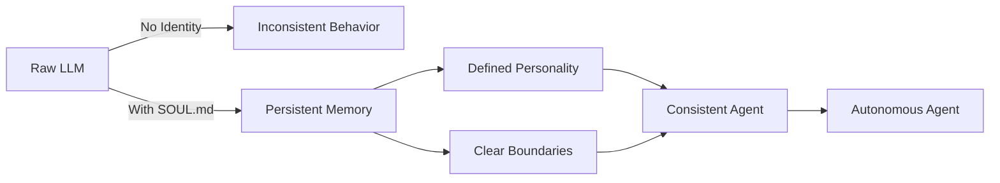

# Designing the SOUL.md Identity File for AI Agents: Building Memory, Personality, and Boundaries  

## Overview  
This course teaches you how to craft an **SOUL.md** identity file that serves as the foundational read‑in for any AI agent before it takes its first action. You will learn why an identity file transforms a raw language model into a purposeful agent with persistent memory, a defined personality, and clear behavioral boundaries. By the end of the course you will be able to design, implement, and troubleshoot SOUL.md files for a variety of agentic applications.  

## Background & Context  
The rise of large language models (LLMs) has made it trivial to generate fluent text, but raw LLMs lack the continuity, consistency, and safety guarantees required for autonomous agents. Early agent frameworks such as AutoGPT, BabyAGI, and LangChain agents demonstrated that agents repeatedly forget prior steps, drift into irrelevant topics, or violate user‑specified constraints when they rely solely on the model’s internal context window. Researchers and practitioners responded by externalizing the agent’s “self” into a separate, immutable document that is loaded at startup and referenced throughout the agent’s lifecycle.  

Alex Prompter’s tweet introduced the term **SOUL.md** as a shorthand for this identity file, emphasizing that without it an agent is merely a raw LLM with no memory, no personality, and no boundaries. The concept quickly gained traction in the AI‑agent community because it provides a concrete, version‑controlled artifact that can be audited, shared, and iterated upon—much like a software manifest or a Dockerfile for agent behavior.  

Today, SOUL.md files are used in production agents ranging from customer‑service bots that must remember policy limits, to creative companions that maintain a consistent voice across long conversations, to safety‑critical systems that must never cross predefined ethical lines. Understanding how to construct and maintain an SOUL.md file is therefore a core competency for anyone building reliable, trustworthy AI agents.  

## Core Concepts  

### SOUL.md as the Identity File  
The SOUL.md file is a plain‑text (typically Markdown) document that an AI agent reads **before** it performs any other operation. Its contents are treated as immutable instructions that shape the agent’s perception of itself and its operating environment. Unlike a system prompt that may be overridden at runtime, the SOUL.md is loaded once at initialization and remains the authoritative source of the agent’s identity throughout its session.  

### Raw LLM vs. Identity‑Augmented Agent  
A raw LLM is a statistical next‑token predictor that has no inherent sense of self, no recollection of past interactions, and no built‑in constraints beyond those imposed by the prompt at inference time. When an agent lacks an SOUL.md, each turn is essentially a fresh inference conditioned only on the immediate user input and any transient context the developer manually injects. This leads to three critical deficiencies:  

1. **No memory** – the model cannot retain facts across turns unless they are explicitly placed in the context window.  
2. **No personality** – the model’s tone, style, and values fluctuate with the prompt, making consistent behavior impossible.  
3. **No boundaries** – without explicit guardrails, the model may produce harmful, off‑policy, or nonsensical outputs.  

By contrast, an agent that reads an SOUL.md gains a persistent self‑model that can be referenced to retrieve memory snippets, enforce personality traits, and apply boundary rules on every reasoning step.  

### Memory Component  
The memory section of SOUL.md declares what information the agent should retain and how it should be retrieved. Common patterns include:  

- **Static facts** (e.g., “User’s name is Alex; preferred pronouns are they/them”).  
- **Dynamic logs** (e.g., a rolling summary of the last five conversation turns stored in an external vector store).  
- **Knowledge base references** (e.g., links to FAQ documents or internal wikis).  

When the agent’s reasoning loop begins, it loads these memory artifacts into its working context, allowing it to answer questions that depend on historical information without exceeding the model’s token limit.  

### Personality Component  
Personality defines the agent’s voice, tone, values, and stylistic preferences. In SOUL.md this is expressed through a set of declarative statements such as:  

- “Always respond in a friendly, empathetic tone.”  
- “Use humor sparingly and only when the user appears relaxed.”  
- “Prioritize clarity over brevity; explain technical concepts with analogies.”  

These statements are consulted before each generation step, often by prepending them to the system prompt or by using them to guide a personality‑conditioned decoding strategy (e.g., applying a bias toward words associated with the desired tone).  

### Boundaries Component  
Boundaries encode the agent’s operational limits—what it must **never** do, what it must **always** do, and what requires explicit user consent. Examples include:  

- “Never disclose personal data unless the user explicitly asks for it.”  
- “Refuse to generate content that depicts violence, hate speech, or illegal activities.”  
- “Always ask for confirmation before performing an external action such as sending an email or making a purchase.”  

During reasoning, the agent checks each proposed action against the boundary rules; if a violation is detected, the action is aborted and a safe fallback response is generated.  

### Initialization Flow  
The agent’s startup sequence can be summarized as:  

1. **Load SOUL.md** – read the file into memory, parse its sections (memory, personality, boundaries).  
2. **Inject static memory** – embed declared facts into the initial system prompt.  
3. **Set personality modifiers** – configure decoding parameters or prompt prefixes that enforce tone.  
4. **Activate boundary checker** – load a rule‑engine that will vet every tool call or content generation request.  
5. **Enter reasoning loop** – for each user turn, retrieve relevant dynamic memory, apply personality, generate candidate output, validate against boundaries, and return the final response.  

## How It Works / Step‑by‑Step  

### Step 1: Create the SOUL.md File  
Open a text editor and create a file named `SOUL.md`. Use Markdown headings to separate the three core sections:  

```markdown
# SOUL.md – Agent Identity

## Memory
- User's name: Alex
- Preferred pronouns: they/them
- Conversation summary: (updated dynamically)

## Personality
- Tone: friendly and empathetic
- Style: clear, concise, with occasional analogies
- Values: honesty, respect, curiosity

## Boundaries
- Do not share personal data without explicit consent.
- Refuse to generate violent, hateful, or illegal content.
- Require confirmation before executing external actions (e.g., sending emails, making purchases).
```

### Step 2: Load the File at Agent Startup  
In your agent’s initialization code (Python example using LangChain), read the file and split it into sections:  

```python
import pathlib

def load_soul(filepath: str = "SOUL.md") -> dict:
    text = pathlib.Path(filepath).read_text(encoding="utf-8")
    sections = {"memory": "", "personality": "", "boundaries": ""}
    current = None
    for line in text.splitlines():
        if line.startswith("## "):
            current = line[3:].lower().strip()
        elif current:
            sections[current] += line + "\n"
    return sections

soul = load_soul()
```

### Step 3: Merge Static Memory into the System Prompt  
Prepend the static memory facts to the system prompt that guides the LLM:  

```python
system_prompt = (
    "You are a helpful AI agent.\n"
    f"Memory:\n{soul['memory']}\n"
    f"Personality:\n{soul['personality']}\n"
    f"Boundaries:\n{soul['boundaries']}\n"
    "Answer the user's query while adhering to the above instructions."
)
```

### Step 4: Apply Personality During Generation  
Adjust decoding parameters to reflect the desired tone. For instance, to encourage friendliness you might increase the probability of words like “glad,” “happy,” and “please”:  

```python
from transformers import LogitsProcessorList, EncoderDecoderLogitsProcessor

class PersonalityLogitsProcessor:
    def __init__(self, friendly_terms):
        self.friendly_terms = friendly_terms

    def __call__(self, input_ids, scores):
        # Boost logits for friendly terms
        for term in self.friendly_terms:
            token_id = tokenizer.encode(term, add_special_tokens=False)[0]
            scores[:, token_id] += 1.0  # simple additive bias
        return scores

friendly_terms = ["glad", "happy", "please", "thank you"]
logits_processor = LogitsProcessorList([PersonalityLogitsProcessor(friendly_terms)])

output = model.generate(
    **inputs,
    max_new_tokens=150,
    logits_processor=logits_processor,
)
```

### Step 5: Enforce Boundaries Before Execution  
Before any tool call or content release, run a boundary check:  

```python
def check_boundaries(action: str, content: str) -> bool:
    if "personal data" in action.lower() and "consent" not in content.lower():
        return False
    if any(word in content.lower() for word in ["violence", "hate", "illegal"]):
        return False
    return True

# Example usage
if not check_boundaries("send_email", email_body):
    return "I’m sorry, I can’t send that message without your explicit consent."
```

### Step 6: Update Dynamic Memory  
After each turn, summarize the interaction and store it for future retrieval:  

```python
def update_memory(summary: str):
    # Append to a file or vector store
    with open("memory_log.txt", "a", encoding="utf-8") as f:
        f.write(summary + "\n")
```

Repeat steps 4‑6 for every user interaction.  

## Real-World Examples & Use Cases  

### Example 1: Customer‑Support Agent  
A telecom company deploys an agent that must remember each customer’s account number, service plan, and recent issue tickets. The SOUL.md contains:  

- **Memory**: static account facts plus a pointer to a vector store of the last three support tickets.  
- **Personality**: professional, patient, and solution‑oriented.  
- **Boundaries**: never disclose payment details without two‑factor verification; never promise discounts beyond authorized limits.  

When a user asks, “Why is my bill higher this month?” the agent pulls the latest ticket, sees a recent data‑overage charge, explains it in a friendly tone, and offers to upgrade the plan only after confirming the user’s consent.  

### Example 2: Personal Creative Companion  
A writer uses an agent to brainstorm story ideas. The SOUL.md specifies:  

- **Memory**: a list of preferred genres (fantasy, sci‑fi) and recurring motifs the writer likes.  
- **Personality**: imaginative, encouraging, and slightly whimsical.  
- **Boundaries**: refuse to generate plagiarized text; avoid producing content that could be deemed offensive to protected groups.  

The agent suggests plot twists that align with the writer’s taste, maintains a whimsical tone throughout the conversation, and checks each suggestion against a plagiarism detector before presenting it.  

### Example 3: Educational Tutoring Bot  
An online tutoring platform employs an agent to help students with algebra. The SOUL.md includes:  

- **Memory**: the student’s current topic (quadratic equations), mastery level, and common mistake patterns.  
- **Personality**: patient, clear, and supportive; uses analogies from sports or gaming.  
- **Boundaries**: never give away the answer to a homework problem without guiding the student through the steps; never share personal data about other students.  

When a student struggles with factoring, the agent recalls the student’s tendency to miss sign changes, offers a sports‑analogy (“think of the signs as teammates who must stay together”), and walks through each step, refusing to provide the final factored form until the student attempts it.  

## Key Insights & Takeaways  

- The SOUL.md file is the **first and only** artifact an agent reads before any reasoning, making it the single source of truth for memory, personality, and boundaries.  
- Without an SOUL.md, an agent behaves like a raw LLM: stateless, inconsistent, and potentially unsafe.  
- Memory in SOUL.md can be split into **static facts** (loaded once) and **dynamic logs** (updated each turn) to overcome context‑window limits.  
- Personality is enforced by **prompt prefixing**, **decoding‑time logits biasing**, or **style‑conditioned sampling**, ensuring consistent tone across interactions.  
- Boundaries must be **machine‑checkable rules** (e.g., regex, keyword lists, or calls to external safety classifiers) that are evaluated **before** any tool execution or content emission.  
- The initialization flow—load SOUL.md → inject memory → set personality → activate boundary checker → enter reasoning loop—should be implemented as a reusable library function to avoid boilerplate.  
- Version‑controlling SOUL.md (e.g., in Git) enables auditability, rollback, and team collaboration on agent behavior.  
- Real‑world agents benefit from separating **concerns**: memory storage (vector DB or file), personality tuning (prompt engineering or LoRA adapters), and boundary enforcement (rule engine or ML classifier).  
- Regularly reviewing and updating the SOUL.md prevents drift: as the agent’s responsibilities evolve, its identity file must evolve in lockstep.  

## Common Pitfalls / What to Watch Out For  

- **Overloading the static memory section** with too many facts can exceed the model’s context window before any user input is even seen, causing truncation of important instructions. Keep static memory concise and reference large knowledge bases externally.  
- **Neglecting to update dynamic memory** leads to the agent “forgetting” recent interactions, making it appear inattentive or repetitive. Implement a automatic summarization step after each turn.  
- **Using vague personality statements** (e.g., “be nice”) results in inconsistent interpretation by the model. Prefer concrete, observable directives such as “use at least one empathic phrase per response.”  
- **Relying solely on keyword‑based boundary checks** can be evaded through synonyms or misspellings. Augment rule‑based checks with a lightweight classifier trained on harmful content examples.  
- **Forgetting to re‑load SOUL.md after a hot‑swap** in a long‑running service can cause the agent to run with stale identity. Design the agent to watch the file for modifications and reload safely without dropping active sessions.  
- **Treating SOUL.md as a prompt template** and filling it with user‑provided data at runtime can introduce injection attacks. Keep the file immutable; any user‑specific data should go into the dynamic memory store, not the SOUL.md itself.  
- **Assuming the model will always follow personality guidance** without reinforcement. Periodically evaluate generated outputs against a personality rubric and fine‑tune or adjust logits processors as needed.  

## Review Questions  

1. **Explain why an agent lacking an SOUL.md cannot retain information across conversation turns, and describe two mechanisms by which the memory section of SOUL.md overcomes this limitation.**  
2. **Outline the step‑by‑step process an agent follows from startup to generating its first response, highlighting where memory, personality, and boundaries are each applied.**  
3. **Imagine you are deploying an agent that must schedule meetings on behalf of a user. Draft a concise SOUL.md snippet (memory, personality, boundaries) that would prevent the agent from accidentally sharing the user’s calendar with unauthorized parties, and explain how each part contributes to that safety guarantee.**  

## Further Learning  

- Study the **LangChain Agent Architecture** to see how external memory stores (e.g., FAISS, Pinecone) integrate with identity files.  
- Explore **Prompt Injection defenses** and learn how to keep SOUL.md immutable while still allowing user‑specific data to flow safely into the agent’s runtime.  
- Investigate **Parameter‑Efficient Fine‑Tuning (PEFT)** methods such as LoRA for encoding personality traits directly into model weights, reducing reliance on runtime logits processors.  
- Read recent papers on **Neuro‑Symbolic Agents** that combine rule‑based boundary engines with neural language models for provable safety guarantees.  
- Experiment with version‑control workflows for SOUL.md using GitHub Actions to automatically test boundary compliance on every change via a CI pipeline that runs a suite of adversarial prompts.  

---  

*End of course.*

<!-- auto-diagram -->

