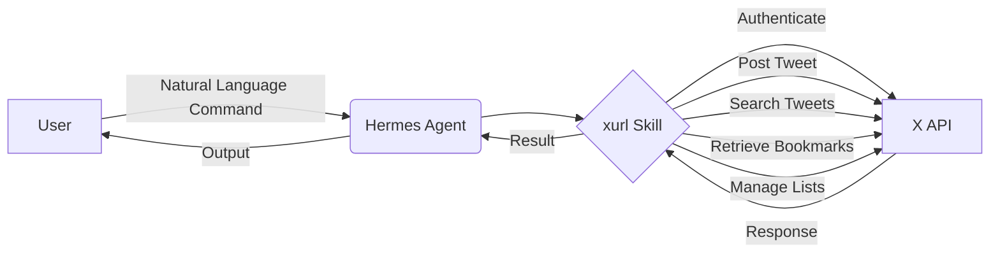

# Mastering the xurl Skill: Enabling Hermes Agents to Interact with X (Twitter) via Natural Language  

## Overview  
This course teaches how to equip a Hermes Agent with the **xurl skill**, a capability that lets the agent read and write to X (formerly Twitter) on a user’s behalf using plain‑language commands. You will learn the purpose of the xurl skill, how it integrates with the Hermes Agent framework, and the exact steps required to set it up and use it for posting, searching, retrieving bookmarks, managing lists, and other X operations. By the end of the course you will be able to configure, test, and deploy an AI‑driven social‑media assistant that understands natural‑language instructions and executes them reliably on X.  

## Background & Context  
AI agents have evolved from simple rule‑based bots to sophisticated systems capable of reasoning, planning, and acting across multiple digital domains. Social media platforms like X generate vast streams of real‑time information that are valuable for monitoring trends, engaging audiences, and curating content. However, manually interacting with X via its API or web interface is time‑consuming and requires technical familiarity with authentication, rate limits, and endpoint specifics.  

The **@xai** team recognized this friction and developed the **xurl skill** as a modular add‑on for the **Hermes Agent**, an open‑source agent framework designed to orchestrate language‑model‑driven planning and tool use. By encapsulating the X API behind a natural‑language interface, the xurl skill lets non‑technical users issue commands such as “Post a tweet about today’s product launch” or “Show me the latest bookmarks from my AI research list” without writing code.  

The skill was released alongside a **full setup guide** hosted by @xai, which walks users through credential generation, skill installation, and command mapping. This guide is significant because it lowers the barrier to entry for integrating powerful language models with production‑grade social‑media automation, enabling use cases ranging from community management to real‑time news aggregation.  

Understanding the xurl skill also situates learners within the broader trend of **skill‑based agent architectures**, where capabilities are packaged as reusable plugins that agents can load at runtime. This approach promotes modularity, safety (by scoping permissions per skill), and rapid experimentation—core principles that underlie modern agentic AI systems.  

## Core Concepts  

### AI Agent  
An AI agent is a software entity that perceives its environment, makes decisions, and executes actions to achieve goals. In the context of language‑model‑based agents, perception often comes from textual input (user prompts or sensor data), reasoning is performed by a large language model (LLM), and actions are carried out via external tools or APIs. Agents differ from static chatbots because they can invoke tools, maintain state, and plan multi‑step sequences. The Hermes Agent exemplifies this paradigm by coupling an LLM planner with a tool‑execution engine that can load skills such as xurl.  

### Hermes Agent  
Hermes Agent is a reference implementation of a skill‑oriented agent framework released by the Nous Research community. It provides a core loop that: (1) receives a user instruction, (2) asks the LLM to decompose the instruction into a plan of tool calls, (3) executes each tool via its skill interface, (4) observes the result, and (5) iterates until the goal is satisfied. Hermes is designed to be extensible; developers can write new skills in Python (or other languages) and register them with the agent’s skill registry. The framework handles credential management, logging, and safety wrappers, allowing skill authors to focus on the domain‑specific logic of their tool.  

### xurl Skill  
The xurl skill is a Hermes‑compatible plugin that wraps the X API (v2) to provide high‑level, natural‑language‑driven operations. Internally, the skill translates user utterances into a sequence of API calls: for example, “Post a tweet saying hello” maps to a `POST /2/tweets` request with the appropriate payload. The skill also supports reading endpoints such as `GET /2/tweets/search/recent` for searching, `GET /2/users/:id/bookmarks` for retrieving bookmarks, and `POST /2/users/:id/list_memberships` for list management. By exposing these functions through a unified natural‑language interface, the xurl skill eliminates the need for users to learn X’s endpoint nomenclature or authentication flow.  

### Natural Language Interface  
A natural language interface (NLI) allows users to interact with software using everyday speech or text rather than formal command syntax or graphical menus. In the xurl skill, the NLI is powered by the Hermes Agent’s LLM, which interprets the user’s intent, extracts slots (e.g., tweet text, search query, list name), and maps them to the skill’s internal API calls. The interface is robust to paraphrase: “Can you share my thoughts on the new feature?” and “Please tweet about the new feature” both resolve to the same posting action. This flexibility is achieved through prompt engineering that defines the skill’s capabilities and few‑shot examples of valid utterances.  

### X (Twitter) API Integration  
X’s developer platform offers a RESTful API (v2) that enables reading and writing tweets, user data, direct messages, bookmarks, lists, and more. Access requires OAuth 2.0 bearer tokens tied to a developer app with appropriate scopes (e.g., `tweet.read`, `tweet.write`, `offline.access`, `users.read`, `bookmark.read`, `list.write`). The xurl skill abstracts this complexity by storing the token securely (often in environment variables or a vault) and automatically attaching it to each outbound request. The skill also handles rate‑limit responses by backing off and retrying, ensuring stable operation under typical usage limits.  

### Core Operations Enabled by xurl  
- **Posting**: Create original tweets, reply to existing tweets, or quote‑tweet with media attachments.  
- **Searching**: Retrieve recent tweets matching a keyword, hashtag, or user‑specified query, with optional filters for language or result type.  
- **Bookmarks**: Pull a user’s saved bookmarks, add new bookmarks, or remove existing ones.  
- **List Management**: Create, edit, delete lists; add or remove users from lists; fetch list memberships or list timelines.  
- **Additional Features**: Fetch user profiles, retrieve tweet metrics (likes, retweets), and manage direct messages (if scopes are granted).  

Each operation is invoked via a natural‑language prompt that the Hermes Agent routes to the xurl skill, which then performs the underlying API call(s) and returns a formatted response to the user.  

## How It Works / Step‑by‑Step  

### Step 1: Obtain the Setup Guide  
Visit the @xai‑published guide (typically linked from the tweet or the Hermes Agent documentation). The guide contains:  
- Prerequisites (Python ≥ 3.9, Git, Hermes Agent installed).  
- Instructions for creating an X developer app and generating OAuth 2.0 credentials.  
- A `requirements.txt` snippet for the xurl skill dependencies.  
- Example configuration files (`hermes_config.yaml`, `xurl_skill.yaml`).  

### Step 2: Install Hermes Agent (if not already present)  
```bash
# Clone the Hermes Agent repository
git clone https://github.com/NousResearch/HermesAgent.git
cd HermesAgent
# Create a virtual environment
python -m venv venv
source venv/bin/activate
# Install core Hermes dependencies
pip install -r requirements.txt
```

### Step 3: Add the xurl Skill  
```bash
# From the HermesAgent root, install the skill as a Python package
pip install git+https://github.com/xai/xurl-skill.git
# Alternatively, copy the skill folder into HermesAgent/skills/
cp -r /path/to/xurl-skill HermesAgent/skills/
```

### Step 4: Configure X API Credentials  
Create a file `config/xurl.yaml` (or set environment variables) with the following structure:  
```yaml
xurl:
  bearer_token: "YOUR_OAUTH2_BEARER_TOKEN"
  # Optional: refresh token if using offline access
  refresh_token: "YOUR_REFRESH_TOKEN"
  token_url: "https://api.twitter.com/2/oauth2/token"
  client_id: "YOUR_CLIENT_ID"
  client_secret: "YOUR_CLIENT_SECRET"
```
The Hermes Agent will load this configuration when the skill is initialized.  

### Step 5: Register the Skill with Hermes  
Edit `hermes_config.yaml` to include the xurl skill in the active skills list:  
```yaml
skills:
  - name: "xurl"
    enabled: true
    config_path: "config/xurl.yaml"
```
Restart the Hermes Agent service to load the new skill.  

### Step 6: Test Natural‑Language Commands  
Start the Hermes Agent interactive shell:  
```bash
python -m hermes --interactive
```
Try the following prompts and observe the agent’s reasoning and tool calls:  

- **Posting**:  
  > “Post a tweet saying ‘Hello world from my Hermes Agent!’”  
  The agent should:  
  1. Recognize the intent `post_tweet`.  
  2. Extract the slot `text = "Hello world from my Hermes Agent!"`.  
  3. Call the xurl skill’s `post_tweet` tool.  
  4. Return the newly created tweet ID and a confirmation message.  

- **Searching**:  
  > “Find recent tweets about LangChain.”  
  The agent will:  
  1. Map to `search_tweets`.  
  2. Populate `query = "LangChain"` and optionally `max_results = 10`.  
  3. Invoke the X recent‑search endpoint.  
  4. Return a formatted list of tweet texts, authors, and timestamps.  

- **Pulling Bookmarks**:  
  > “Show me my saved bookmarks.”  
  The agent triggers `get_bookmarks`, which calls `GET /2/users/:id/bookmarks` and returns each bookmarked tweet with metadata.  

- **Managing Lists**:  
  > “Add @openai to my ‘AI Thought Leaders’ list.”  
  The agent parses:  
  - `list_name = "AI Thought Leaders"`  
  - `target_user = "openai"`  
  It then:  
  1. Looks up the list ID (if needed via `GET /2/users/:id/owned_lists`).  
  2. Calls `POST /2/users/:source_user_id/list_memberships` with the target user ID.  
  3. Confirms addition or reports if the user is already a member.  

### Step 7: Deploy and Monitor  
For production use, run the Hermes Agent as a service (e.g., via systemd, Docker, or Kubernetes). Enable logging to capture skill invocations and API responses. Set up alerts for authentication failures or rate‑limit warnings so you can refresh tokens or adjust request frequency.  

## Real‑World Examples & Use Cases  

### Example 1: Automated Community Engagement  
A Discord community manager wants to thank new members who follow the project’s X account. Using the xurl skill, they create a Hermes Agent workflow that:  
1. Periodically searches for recent followers (`GET /2/users/:id/followers`).  
2. For each new follower, composes a personalized thank‑you tweet (“Thanks for following, @newuser! Check out our latest blog post …”).  
3. Posts the tweet via the xurl skill.  
The manager only needs to define the schedule and the thank‑you message template; the agent handles the rest, ensuring timely engagement without manual monitoring.  

### Example 2: Research Bookmark Curation  
A graduate student collects papers and articles by bookmarking relevant tweets that contain links to preprints. They instruct their Hermes Agent:  
> “Every morning, pull my X bookmarks, extract any URLs pointing to arxiv.org, and append them to a markdown reading list.”  
The agent executes:  
- `get_bookmarks` to retrieve the latest saved tweets.  
- Parses each tweet’s text for arXiv URLs using a simple regex.  
- Writes the collected links to `reading_list.md`.  
This automation keeps the student’s bibliography up‑to‑date with minimal effort.  

### Example 3: Dynamic List Maintenance for Influencer Tracking  
A marketing analyst maintains a private X list of influencers in the renewable energy sector. They set up a Hermes Agent that:  
- Watches for tweets containing the hashtag `#RenewableEnergy` and a mention of a new influencer.  
- When a new influencer is detected, the agent adds them to the list via `POST /2/users/:source_user_id/list_memberships`.  
- Once a month, the agent removes any list members who have not tweeted in the past 90 days (using `GET /2/users/:id/tweets` to check activity).  
The list stays current, enabling the analyst to reliably source quotes and collaborations.  

## Key Insights & Takeaways  
- The xurl skill transforms the X API into a set of natural‑language‑callable functions, removing the need for developers to memorize endpoint paths or payload structures.  
- Hermes Agent’s skill‑based architecture lets you add or remove capabilities like xurl at runtime, promoting modularity and safe experimentation.  
- Proper OAuth 2.0 token management (including refresh tokens) is essential for uninterrupted operation; the skill handles token injection but relies on secure storage of credentials.  
- Natural‑language robustness is achieved through prompt engineering and slot filling; variations in phrasing (e.g., “Post a tweet” vs. “Send out a tweet”) are interpreted correctly when the skill’s description includes sufficient examples.  
- Rate‑limit handling is built into the skill; however, high‑frequency polling (e.g., checking for new followers every minute) may still exhaust limits, so schedule tasks according to X’s usage policy.  
- The skill supports both read and write operations, enabling end‑to‑end automation cycles such as “search for a topic → generate a summary tweet → post it”.  
- Error messages from the X API are surfaced through the Hermes Agent’s logging, allowing users to diagnose authentication, permission, or validation issues quickly.  
- By combining the xurl skill with other Hermes skills (e.g., a summarizer or a web scraper), you can construct sophisticated pipelines like “read trending tweets → summarize → post a daily digest”.  
- The setup guide published by @xai is the canonical source for version‑specific instructions; always consult it when upgrading the skill or Hermes Agent.  
- Understanding the underlying API scopes helps you adhere to the principle of least privilege: only grant the xurl skill the permissions it truly needs (e.g., avoid giving `direct_message.write` if you never plan to send DMs).  

## Common Pitfalls / What to Watch Out For  
- **Missing or Scoped Tokens**: Using a bearer token lacking the `tweet.write` scope will cause posting attempts to fail with a 403 error; verify scopes in the X developer portal before testing.  
- **Hard‑coding Credentials**: Storing tokens directly in source code or public repositories exposes them to theft; always use environment variables, secret managers, or encrypted config files.  
- **Ignoring Rate Limits**: Sending more than 300 tweets per 15‑minute window (standard write limit) will trigger HTTP 429 responses; implement exponential backoff or throttle your agent’s frequency.  
- **Over‑reliance on Exact Phrasing**: If the skill’s prompt examples are too narrow, paraphrased commands may not be recognized; enrich the skill’s description with varied utterances during setup.  
- **Neglecting Pagination**: Search and bookmark endpoints return paginated results; failing to follow `next_token` leads to incomplete data sets. The xurl skill handles pagination internally, but custom wrappers must respect it.  
- **Assuming Immediate Propagation**: After posting a tweet, it may take a few seconds to appear in search results; design workflows that accommodate slight delays (e.g., wait and retry before verifying).  
- **Misinterpreting List Ownership**: Only the list owner can add or remove members; attempting to modify a list you do not own results in a 403 error. Verify ownership via `GET /2/users/:id/owned_lists` before modification.  
- **Overlooking Media Uploads**: Posting tweets with images or video requires a separate media upload endpoint; the basic xurl skill may only support text tweets unless extended. Check the skill’s documentation for media capabilities.  
- **Failing to Handle Deleted Tweets**: When retrieving bookmarks or timelines, some tweets may have been deleted; the API returns them with a `withheld` flag—your application should gracefully skip or log such entries.  
- **Skipping Updates**: The X API evolves; periodically check the @xai guide for updates to the xurl skill that align with new API versions or authentication changes.  

## Review Questions  
1. **Explain how the Hermes Agent’s planning loop interacts with the xurl skill when a user issues the command “Search for recent tweets about quantum computing.” Include the steps of intent recognition, slot filling, tool invocation, and result presentation.**  
2. **Describe the process of configuring the xurl skill for write access to X, detailing the required OAuth 2.0 scopes, where credentials are stored, and how the skill attaches them to API requests.**  
3. **A user wants their Hermes Agent to automatically add any new follower who mentions the phrase “AI safety” to a private X list called “Safety Advocates.” Outline a complete workflow—from detecting the mention to updating the list—indicating which xurl skill operations are used at each stage and any additional Hermes skills that might be needed.**  

## Further Learning  
- **Advanced Hermes Agent Development**: Learn how to write custom skills in Python, manage skill dependencies, and implement custom logging and monitoring.  
- **X API Deep Dive**: Explore the full range of X endpoints (spaces, fleets, analytics, compliance) and understand how to request additional academic or elevated access tiers.  
- **Prompt Engineering for Tool Use**: Study techniques for designing effective few‑shot examples and instruction prompts that improve an LLM’s reliability in selecting the correct tool and extracting accurate parameters.  
- **Multi‑Skill Agent Architectures**: Investigate how to combine the xurl skill with other Hermes skills such as a web scraper, summarizer, or code executor to build end‑to‑end automation pipelines (e.g., “read trending topics → generate a blog post → schedule and tweet it”).  
- **Security Best Practices for Agent Credentials**: Review guidelines for storing secrets, rotating tokens, and implementing least‑privilege access controls in agent-based systems.  
- **Rate‑Limit Management and Back‑off Strategies**: Study algorithms for handling HTTP 429 responses, including jittered exponential backoff and queue‑based throttling to maximize throughput without getting blocked.  
- **Community Resources**: Join the Nous Research Discord and the Hermes Agent GitHub discussions to stay updated on new skills, troubleshooting tips, and real‑world project showcases.  

---  

*This course is self‑contained; all necessary concepts, procedures, and examples have been drawn from the provided source and expanded with expert knowledge to ensure a thorough understanding of how to enable Hermes Agents to read and write to X via the xurl skill.*

<!-- auto-diagram -->

