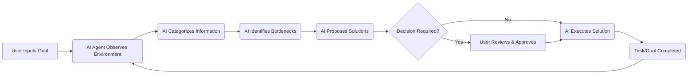

# The Autonomous Workflow: Mastering Productivity with AI Agents

## Overview
This course explores the revolutionary concept of leveraging AI Agents to transition from manual task management to autonomous, self-sorting productivity systems. We will dissect how an AI system can handle the complex cognitive labor of planning, organizing, monitoring, and delegating tasks, allowing users to achieve sustained success without constant manual intervention. This training provides the foundational knowledge to design and implement intelligent workflow systems.

## Background & Context
The necessity for AI Agents arises from the overwhelming complexity of modern workflows. Traditional productivity systems, like Task Managers (e.g., Todoist, Notion), require significant cognitive effort from the user for daily maintenance: sorting, prioritizing, remembering stalled projects, and assigning follow-up actions. This manual cognitive load often leads to procrastination, incomplete work, and burnout.

AI Agents represent a paradigm shift by introducing autonomous systems capable of executing multi-step goals. They move beyond simple automation (like setting up a scheduled reminder) into true cognitive delegation, acting as digital assistants that observe the environment, categorize information, identify bottlenecks, and propose or execute solutions. This technology fits into the broader landscape of AI by enabling the transition from simple tools to intelligent collaborators that manage complex, long-term objectives.

## Core Concepts

### The Burden of Manual Management
This concept addresses the inefficiency inherent in relying solely on human memory and executive function for complex organizational tasks. When an individual attempts to manage a life or a project, they must dedicate significant mental energy to constantly tracking deadlines, sorting notes, remembering stalled projects, and prioritizing future actions. This cognitive overhead is a major source of friction, leading to "context switching" and task paralysis, which ultimately undermines long-term productivity.

### The Principle of Cognitive Offloading
Cognitive offloading is the psychological process where humans delegate mental tasks to external tools or systems to free up internal cognitive resources for higher-level thinking and creativity. The goal is not just to automate a single step, but to create an environment where the system handles the tedious, repetitive cognitive labor of organization and planning. When a system handles sorting and flagging, the user is freed to focus on the meaningful work, rather than the administrative work of getting the work done.

### AI Agents as Autonomous Executors
An AI Agent is a software entity designed to perceive its environment, make decisions, and take actions to achieve a defined goal, often without continuous human input. Unlike simple scripts or chatbots, an agent possesses planning, memory, and tool-use capabilities. This capability allows it to handle complex, multi-stage processes—such as reviewing unstructured data, identifying bottlenecks, and reassigning tasks—acting as a proactive manager rather than a passive tool.

### The Power of Aggregation and Synthesis
This principle involves collecting disparate pieces of information (notes, emails, project files, communication threads) and synthesizing them into a coherent, actionable structure. Instead of simply storing data, the agent must understand the semantic relationships between the data points. This involves sorting information into logical categories, identifying thematic clusters, and synthesizing the status of projects to create a holistic overview that is immediately useful to the user.

## Deep Dive

The source material provides a compelling, real-world example of an AI Agent in action, demonstrating the potential shift from reactive management to proactive system execution. Let’s dissect the process described:

### The Before State: Manual Overload
Before the AI Agent intervention, the individual was burdened by the necessity of manually managing a complex life. This involved:
1. **Information Dispersion:** Notes, ideas, project details, and communication were scattered across various locations (physical folders, digital notes, emails).
2. **Reactive Management:** The user had to manually open and manage a task manager, which often involved manually categorizing notes and recalling the status of projects.
3. **Stalled Momentum:** Projects often fell into a state of being "stalled" because the difficulty lay in remembering *what* to do next, rather than the task itself.

### The Intervention: Dumping into a Single Folder
The key action—"he dumped everything into one folder before bed and closed his laptop"—is the crucial input for the AI Agent. This step represents the act of providing the raw, unstructured data to the system. The system does not require the user to manually sort; it requires the raw material for organization. This emphasizes that the agent is designed to handle the complexity of organization, not the complexity of input.

### The Agent’s Process: Automated Cognitive Labor
Upon receiving the aggregated data, the AI Agent executes a multi-step workflow:
1. **Sorting and Categorization:** The system analyzes all dumped information (notes, files, communication) and sorts them into logical categories (e.g., Work, Personal, Pending, High Priority).
2. **Stalled Project Flagging:** The agent cross-references project statuses and identifies tasks that have not been addressed or have exceeded established timelines, flagging them as stalled or blocked.
3. **Task Assignment:** Based on the sorted and flagged data, the system automatically assigns specific tasks to the appropriate next steps or responsible parties.
4. **System Output:** The result is a structured, actionable view that the user wakes up to, requiring zero manual sorting or prioritization.

## Practical Application

The ability of an AI Agent to perform these complex management functions translates directly into massive personal and professional gains. This is not merely a time-saving trick; it is a change in how cognitive energy is spent.

**Scenario 1: The Freelancer’s Workflow**
A freelance writer, instead of spending two hours each morning sorting emails, reviewing project statuses, and writing to clients about stalled deliverables, dumps all project notes, client communication, and deadlines into a single input folder. The AI Agent then analyzes the folder, automatically flags overdue tasks, assigns follow-up actions (e.g., "Send invoice," "Follow up on project X status"), and structures a daily to-do list. The freelancer wakes up to a perfectly organized plan, allowing them to immediately execute tasks instead of spending time on administrative setup.

**Scenario 2: The Knowledge Worker’s Project Management**
A knowledge worker managing multiple long-term projects (e.g., planning a new feature, writing a report, learning a new skill) finds that tracking dependencies and keeping momentum is challenging. By dumping all brainstorming notes, research links, meeting summaries, and draft documents into the system, the agent analyzes the dependencies. It flags where decisions are missing (stalled projects) and suggests the next logical step, effectively managing the complex dependency tree and maintaining the project on track without the user needing to manually update status logs.

**Scenario 3: Personal Life Organization**
For personal organization, an individual can dump all goals, appointments, family tasks, and personal notes into the system. The Agent then sorts these items into weekly schedules, flags conflicts, and assigns daily action items, ensuring that personal goals remain on track, preventing the feeling of being overwhelmed by scattered personal responsibilities.

## Key Insights & Takeaways
- You can achieve sustained success by delegating the cognitive burden of organization and planning to an autonomous system.
- The most effective way to begin using AI Agents is by providing them with a large, unstructured input of data, rather than trying to manually structure it yourself.
- True productivity is found not in the act of organizing, but in the time gained by having the system handle the sorting, flagging, and assignment.
- AI Agents excel at identifying patterns and anomalies (like stalled projects) that human oversight often misses when facing large volumes of data.
- The system shifts the user's role from being an administrative manager to being a strategic director, focusing on high-level decision-making.
- By aggregating information first, you create the necessary context for the AI to perform its high-level sorting and assignment functions effectively.

## Common Pitfalls / What to Watch Out For
The primary pitfall in implementing AI Agents is treating them as simple automation tools rather than true cognitive partners. Beginners often try to manually train the agent on every nuance of their workflow, which negates the benefit of offloading cognitive labor.

One major mistake is failing to provide sufficient, high-quality input. If the dumped data is disorganized or incomplete, the agent's output will also be flawed ("Garbage in, garbage out"). The system needs context to sort effectively.

Another pitfall is relying too heavily on the agent. The user must maintain oversight to ensure the agent's assignments and flags are accurate. If the user completely ignores the output, the system stops being an aid and becomes a distraction. The ideal scenario is a partnership where the agent manages the execution, and the human provides the strategic direction.

## Review Questions
1. Explain the difference between manual task management and the AI Agent workflow described in the source, focusing on where the primary cognitive effort is spent in each scenario.
2. If you were setting up an AI Agent for a new project, what is the most crucial piece of input (the "dump") you would provide, and why?
3. How does the concept of "cognitive offloading" enable the user to achieve "life still on track," and what role does the AI agent play in this realization?

## Further Learning
To build upon this foundation, the reader should explore the following topics:

*   **Advanced Prompt Engineering for Agents:** Learning how to craft complex instructions (system prompts) that define the rules, roles, and decision-making hierarchies of an AI Agent.
*   **RAG (Retrieval-Augmented Generation) in Workflow:** Understanding how agents use external data (like documents or notes) to make informed decisions, which is essential for accurate sorting and flagging.
*   **Tool Integration and API Use:** Exploring how AI Agents interface with external tools (like calendar apps, CRM systems, or project trackers) to execute real-world actions, moving beyond theoretical sorting to actual task execution.
*   **Feedback Loops and Self-Correction:** Investigating how agents use feedback from the user (e.g., "This task was incorrectly assigned") to improve their future performance, leading to truly self-improving systems.

<!-- auto-diagram -->

