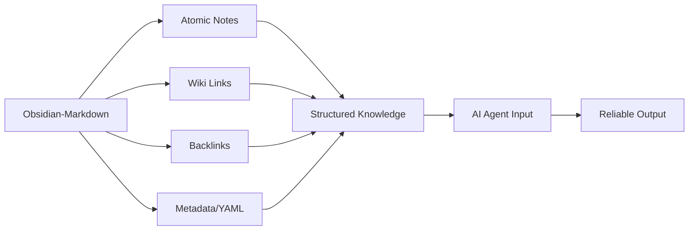

# The Essential Agent Skills: Structuring Knowledge for Reliable AI Workflows

## Overview
This course teaches the foundational skills necessary to train, manage, and guide AI Agents effectively, moving beyond simple prompting to create reliable, complex, and context-aware automated systems. We will explore how structuring personal knowledge—specifically through methodologies like Obsidian—directly translates into the high-fidelity data and context required for AI Agents to perform complex tasks accurately. Understanding these skills is crucial for anyone building sophisticated AI workflows.

## Background & Context
The rise of AI Agents represents a shift from single-prompt interactions to autonomous systems capable of planning, executing, and reflecting on multi-step tasks. While Large Language Models (LLMs) are powerful reasoning engines, their reliability is entirely dependent on the quality and structure of the input they receive. If an agent is fed unstructured, poorly organized data, its output will be unreliable, prone to hallucinations, or fail to execute complex multi-step plans. This course focuses on the specific architectural skills—derived from personal knowledge management systems—that ensure the raw material for AI Agents is structured, interconnected, and easily navigable, thereby fixing the fundamental flaws agents make when processing information.

## Core Concepts

### Obsidian-Markdown
Obsidian-Markdown is the fundamental skill of structuring information using plain text with rich linking and structural elements. This skill is essential because LLMs operate best when context is clearly delineated and semantic relationships are explicitly mapped. By using Markdown syntax, agents can easily parse the text hierarchy, differentiate between facts, definitions, and connections.

The specific components that make this skill powerful include:
*   **Wikilinks (Internal Links):** These establish explicit, semantic connections between different notes, allowing an agent to navigate a knowledge graph rather than searching through monolithic documents.
*   **Callouts:** These allow for the immediate segmentation of critical information (e.g., warnings, definitions, key findings) from the main body of text, enabling agents to quickly identify and prioritize necessary context.
*   **Embeds:** This allows agents to pull in related, contextual information directly into the note, ensuring that the agent's context is rich and immediate.
*   **Frontmatter (YAML Metadata):** This technique allows for the tagging and classification of notes with structured data (e.g., project names, dates, tags). This metadata is vital for agents to filter, sort, and retrieve relevant information efficiently.

### Obsidian-Bases
Obsidian-Bases involves structuring data using database principles within the knowledge base. This skill moves beyond simple note-taking into creating a structured, relational layer of data that is inherently queryable and analytical. This approach is critical because agents often need to perform complex operations, such as data aggregation, filtering, and formula-based calculations, which are natively supported by database structures.

The specific components that define this skill include:
*   **Database Views:** These are pre-defined, optimized perspectives on the raw data, allowing an agent to access complex data without needing to process the entire dataset manually.
*   **Filters:** These are the logic used to define which records are relevant (e.g., "Show all tasks tagged 'urgent' and due this week"), enabling the agent to perform targeted data retrieval.
*   **Formulas:** This allows for the calculation of derived data based on existing fields (e.g., calculating project completion percentage or estimated time remaining), enabling agents to perform analytical reasoning.
*   **Aggregations:** This involves summarizing data (e.g., counting the number of open tasks in a specific project), allowing agents to quickly understand the scope and status of a situation.

## How It Works / Step-by-Step
The five agent skills work in a hierarchical manner, building a robust system for knowledge retrieval and processing. The process involves transforming unstructured information into structured, queryable data, which then feeds the AI Agent's operational memory.

**Step 1: Structuring the Raw Data (Obsidian-Markdown)**
First, all raw knowledge must be written using Markdown and connected using wikilinks. This creates a networked structure where every piece of information is explicitly linked to related concepts. Agents can then traverse these links to build a complete context. For example, instead of a flat document, an agent sees a map of related ideas immediately.

**Step 2: Adding Metadata and Context (Frontmatter)**
Next, every piece of information must be tagged and categorized using Frontmatter. This step transforms notes from static documents into living data records. By applying consistent tags (e.g., `#project/alpha`, `#priority/high`), the agent gains the ability to instantly categorize context before processing the content.

**Step 3: Creating Structured Data Layers (Obsidian-Bases)**
The structured notes are then organized into database views using the Obsidian Bases framework. This is where the relationships become functional queries. An agent can no longer just read a note; it can query the database for all tasks related to a specific project, filtered by priority, and calculated by an aggregation of remaining time.

**Step 4: Enabling Dynamic Interaction (Filters and Formulas)**
Using filters and formulas, the agent can dynamically generate the necessary information for its next step. If the agent needs to prioritize, it uses filters to define the criteria for prioritization. If it needs to predict a timeline, it uses formulas to calculate the results based on the structured inputs.

**Step 5: Executing the Agent Task**
The final step is for the agent to use this structured knowledge base as its foundation. Instead of guessing or hallucinating, the agent retrieves precise, validated data directly from the interconnected and structured system, leading to accurate, traceable, and reliable outcomes.

## Real-World Examples & Use Cases
These skills are not just theoretical; they form the backbone of reliable AI systems:

**Scenario 1: Project Management Agent**
An agent is tasked with analyzing the status of all ongoing projects.
*   **Without Skills:** The agent would have to manually read dozens of documents, attempting to correlate dates and tasks, leading to high error rates.
*   **With Skills:** The agent accesses the `obsidian-bases` view, filtered by the tag `#project/active`. It immediately sees an aggregated view of all active projects. It uses a formula to calculate the total estimated time remaining for all projects marked as high priority, allowing it to prioritize its next action instantly, based on structured data rather than inference.

**Scenario 2: Content Generation Agent**
An agent is asked to write a report on a specific topic that requires referencing internal data.
*   **Without Skills:** The agent would have to rely on the context window of the prompt, which limits its ability to reference deep, specific data.
*   **With Skills:** The agent uses the `obsidian-markdown` wikilinks to jump directly to the source notes containing the necessary data. It uses the Frontmatter tags to verify the source context. It then retrieves the relevant details using structured queries from the `obsidian-bases`, ensuring the generated report is factually accurate and directly traceable back to the knowledge base.

**Scenario 3: Automated Decision-Making Agent**
An agent must decide whether to allocate resources to a new task.
*   **With Skills:** The agent queries the `obsidian-bases` for data. It applies a `filter` to exclude tasks with low priority and uses a `formula` to calculate the weighted impact of the remaining tasks. This systematic, formula-driven analysis eliminates subjective bias and ensures the decision is based on quantifiable, structured metrics.

## Key Insights & Takeaways
*   **Structure is Context:** The fundamental insight is that the structure you impose on your notes dictates the quality of the context provided to an AI Agent, directly impacting its reliability.
*   **Connect, Don't Store:** Effective knowledge management shifts the focus from simply storing information to explicitly mapping semantic relationships (using wikilinks) so agents can navigate connections rather than scanning text.
*   **Metadata is the Agent's Index:** Using Frontmatter (metadata) to tag and classify information transforms passive notes into active, searchable data records, providing the agent with an immediate indexing system.
*   **Data Must Be Queryable:** For an agent to perform complex analysis, the data must be structured using database principles (Obsidian-Bases). Raw text is insufficient; structured data allows for mathematical reasoning and filtering.
*   **Agent Reliability Depends on Structure:** The primary failure point for AI Agents is often poor input data. By applying these five skills, you ensure that the foundation of the agent’s world view is logical, traceable, and mathematically sound, drastically improving output accuracy.

## Common Pitfalls / What to Watch Out For
*   **Ignoring the Structure:** The biggest mistake is treating the knowledge base as a collection of static documents rather than a dynamic, interconnected database. Agents cannot infer structure; it must be explicitly provided.
*   **Relying Solely on LLM Memory:** Assuming that an LLM can magically infer complex relationships or perform accurate calculations from unstructured text is a fatal error. The agent will hallucinate or make logical mistakes when forced to perform analytical tasks on non-structured data.
*   **Inconsistent Tagging:** Failure to enforce strict, consistent tagging schemes (Frontmatter) results in a chaotic knowledge base. An agent cannot reliably filter or aggregate data if the tagging system is arbitrary or inconsistent.
*   **Neglecting Relationships:** Simply linking notes without understanding the transitive relationships between them is insufficient. The agent needs to understand *why* two concepts are linked, not just *that* they are linked.

## Review Questions
1. Explain the functional difference between using wikilinks and Frontmatter when preparing a note for an AI Agent, and why both are necessary for reliable operation.
2. If an AI Agent needs to calculate the remaining time for all high-priority tasks, which specific skill from the Obsidian framework would the agent utilize to perform this calculation, and how would the data need to be structured beforehand?
3. Describe a scenario where the combination of `obsidian-markdown` and `obsidian-bases` would allow an AI Agent to perform a complex, multi-step task with high accuracy, and contrast this with a task performed on unstructured notes.

## Further Learning
To build upon these foundational skills, a reader should explore the following related topics:

*   **Advanced Prompt Engineering for Agents:** Learning how to structure prompts specifically for complex reasoning, planning, and tool use (e.g., Chain-of-Thought prompting, ReAct frameworks).
*   **Vector Databases and RAG:** Understanding how modern Retrieval-Augmented Generation (RAG) systems index unstructured data into vector embeddings, which is the next evolution of connecting unstructured knowledge for AI retrieval.
*   **Workflow Automation Tools:** Exploring tools like Zapier or Make to automate the flow of data *between* the knowledge base and the LLM, turning static knowledge into dynamic actions.
*   **Graph Databases:** Diving deeper into the theory of graph databases (like Neo4j) and how they fundamentally map and query complex, multi-faceted relationships, which is the ultimate goal of the Obsidian-Bases concept.

<!-- auto-diagram -->

