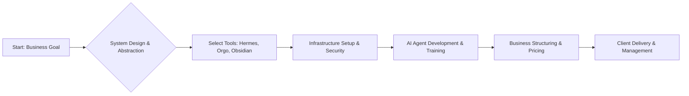

# Building a Solo Managed AI Agent Business: A Full Course on Automation and Infrastructure

## Overview
This course provides a comprehensive roadmap for building and managing a profitable, solo-operated business centered around advanced AI agents. It delves into the practical application of specific, high-level tools like Hermes Agent, Orgo, Obsidian, and Codex to create fully managed, scalable AI agent services. The course focuses not just on the technical setup but also on structuring the business, handling infrastructure, and delivering unlimited usage to clients.

## Background & Context
The rise of AI Agents represents a fundamental shift from simple prompt engineering to creating autonomous, goal-oriented systems that can perform complex tasks. This topic exists because the market is ripe for a specialized service: building and managing AI systems for others. The core problem addressed is that while powerful LLMs exist, deploying them effectively requires sophisticated system design, infrastructure management, and security protocols—which is often too complex for a solo operator. This course addresses this gap by teaching the methodology for abstracting away the complexity, allowing the operator to focus solely on business and delivery.

The landscape of AI development is currently transitioning from experimentation to industrialization. AI Agents, powered by tools like those mentioned, allow businesses to automate workflows end-to-end. The value of this knowledge lies in mastering the integration of coding assistance (Codex, Claude Code), workflow management (Orgo, Obsidian), and agent orchestration (Hermes Agent) to create robust, deployable, and commercially viable solutions. This course positions the student to become an expert in the intersection of AI engineering, systems architecture, and business management.

## Core Concepts

### AI Agents
AI Agents are autonomous entities designed to perceive their environment, make decisions, and take actions to achieve a specific goal. Unlike traditional LLM interactions, which are single prompts, an agent operates in a loop: perceive $\rightarrow$ plan $\rightarrow$ act $\rightarrow$ reflect. This architecture allows for complex, multi-step tasks to be executed without constant human intervention. In a business context, an AI Agent is the core product being sold—a system that performs repeatable, complex tasks for a client.

### Managed AI Agent Business
A "managed" AI Agent business implies a service-based model where the provider doesn't just build the agent but handles the entire lifecycle, including deployment, maintenance, security, and scaling. This shifts the service from a one-time product sale to a continuous, high-value subscription. The "managed" aspect is crucial because it addresses the pain points of most potential customers: complexity, maintenance, and risk management.

### Hermes Agent
Hermes Agent refers to a specific framework or system used for orchestrating, managing, and deploying complex AI agents. It serves as the central control plane, allowing the solo operator to manage multiple agents, define their workflows, and ensure they interact seamlessly within an infrastructure. It is the engine that transforms individual LLM capabilities into cohesive, functional systems.

### Orgo
Orgo, in the context of this course, represents the operational layer or infrastructure management system for the agents. It focuses on the practical deployment, resource allocation, and operational efficiency required to run multiple agents simultaneously. It is the system that handles the "how" of running the agents reliably, ensuring performance and scalability for the end customer.

### Obsidian
Obsidian is the knowledge base and planning layer utilized by the solo operator. It serves as the central hub for documentation, project planning, tracking agent development iterations, security policies, and client management details. It is the critical tool for managing the complexity of the entire business.

### Codex and Claude Code
These terms refer to the use of advanced code generation and assistance tools (like those powered by OpenAI's Codex or Anthropic's Claude) for the development and refinement of the AI Agent systems. They are essential for the solo operator to rapidly prototype, debug, and write the complex code necessary to build the agent's internal logic and external interfaces.

## How It Works / Step-by-Step

The process of building and offering a managed AI agent business solo involves integrating these tools into a cohesive workflow:

**Step 1: Agent Conceptualization and Planning (Using Obsidian)**
*   Define the specific problem the agent will solve (e.g., "Automate customer support triage").
*   Use Obsidian as the central workspace to map out the agent's entire architecture, define goals, document security protocols, and plan the workflow steps. This step ensures clarity before writing any code.

**Step 2: Agent Development and Coding (Using Codex/Claude Code)**
*   Using the plans documented in Obsidian, the operator writes the necessary code for the agent's core functionalities (planning module, tool integration, decision-making).
*   Leverage Codex or Claude Code for assistance in generating complex scripts, API integrations, and optimizing the agent's internal logic. This accelerates the development phase significantly.

**Step 3: Agent Orchestration and Integration (Using Hermes Agent)**
*   Take the developed code and integrate it into the Hermes Agent framework.
*   Configure the Hermes Agent to manage the agent's lifecycle, connect it to necessary external tools (APIs), and define the complex multi-step processes the agent must execute.

**Step 4: Infrastructure and Operational Setup (Using Orgo)**
*   Deploy the orchestrated agent system onto the operational layer, Orgo.
*   Orgo handles the deployment, resource allocation (CPU, memory, API calls), scaling, and ensuring the agent runs reliably and securely 24/7 for the client. This is the "managed" component.

**Step 5: Offering the Service (The Value Proposition)**
*   Package the fully integrated and managed system. The service is offered with the promise of "unlimited agents, unlimited usage, all infrastructure and security included." This comprehensive offering is the result of successfully mastering the integration of all the preceding steps.

## Real-World Examples & Use Cases

**Scenario 1: Automated Content Management Agent**
A client needs an agent to monitor external news sources, summarize key articles, and draft internal executive summaries.
*   **Agent Goal:** Monitor news $\rightarrow$ Summarize $\rightarrow$ Draft Report.
*   **Tool Application:**
    *   **Obsidian:** Used to map the pipeline, define required data sources, and set up security policies for handling sensitive news data.
    *   **Claude Code/Codex:** Used to generate the Python/JavaScript code for the data scraping and summarization functions.
    *   **Hermes Agent:** Used to orchestrate the flow, ensuring the agent correctly calls the scraping tool, feeds the data to the summarization model, and outputs the final draft in a structured format.
    *   **Orgo:** Handles the deployment of this complex system, ensuring the scraping processes run efficiently and cost-effectively on the server infrastructure.

**Scenario 2: Multi-Tool Task Execution Agent**
A client requires an agent that can manage a complex workflow, such as researching a topic, drafting an email, and scheduling a follow-up meeting.
*   **Agent Goal:** Research $\rightarrow$ Draft $\rightarrow$ Schedule.
*   **Tool Application:**
    *   **Hermes Agent:** Acts as the central brain, defining the required steps (researching, writing, scheduling) and managing the handoff between specialized tools.
    *   **Orgo:** Manages the external API calls required for research (e.g., search engines) and scheduling services.
    *   **Obsidian:** Used for documenting the complex dependencies between the research findings and the final email draft, ensuring logical consistency in the output.
    *   **Security:** Implemented via Orgo’s infrastructure layer, ensuring API keys and client data are encrypted and secure.

**Scenario 3: Scaling and Unlimited Usage**
The power of this model is the ability to offer "unlimited usage." This means the operator doesn't rely on fixed-rate pricing but on a scalable infrastructure (Orgo) that can dynamically handle increased load from multiple agents and numerous client tasks. This capability transforms the business from a project service into a scalable SaaS product.

## Key Insights & Takeaways

*   **Mastering Orchestration is Key:** The most valuable skill is not just writing code, but mastering the orchestration framework (like Hermes Agent) to connect disparate tools into a cohesive, goal-oriented system.
*   **Documentation Drives Business:** Using Obsidian for planning and documentation is non-negotiable; it allows the solo operator to manage the complexity of multiple agents and client requirements without getting lost.
*   **Infrastructure is the Product:** The "managed" aspect is delivered by mastering the infrastructure layer (Orgo). Providing robust infrastructure, security, and reliable scaling is what justifies the premium price for the service.
*   **Leverage Code for Speed:** Utilizing tools like Codex and Claude Code drastically reduces the time spent on writing boilerplate code, allowing the solo operator to focus on high-level system design and business strategy.
*   **The Value is in Abstraction:** The market pays for the ability to abstract away the complexity of managing AI infrastructure, security, and complex workflows, delivering a simple, unlimited service to the customer.
*   **Focus on the Full Lifecycle:** A successful business involves managing the agent from conception (Obsidian) through development (Codex), orchestration (Hermes), and deployment (Orgo).

## Common Pitfalls / What to Watch Out For

1.  **The Complexity Trap:** Beginners often get overwhelmed by the sheer number of tools (Hermes, Orgo, Obsidian, Codex, Claude) and struggle to identify which piece of the puzzle is most critical for the current stage of development. Focusing on one tool at a time is essential.
2.  **Neglecting Security:** Since the business involves managing infrastructure and client data, overlooking security protocols (encryption, access control, API key management) is a critical pitfall that can lead to severe legal and reputational damage.
3.  **Infrastructure Underestimation:** Assuming that a simple, local setup is sufficient is a mistake. Scaling up requires understanding cloud infrastructure, cost management, and the ability to manage high-availability systems, which is where Orgo becomes indispensable.
4.  **Over-Engineering the Agent:** Trying to make the agent solve every problem immediately leads to overly complex systems. Start small, define a very narrow, specific task for the first agent, and iterate based on real-world feedback.
5.  **Ignoring the Business Layer:** Focusing purely on the technical setup without structuring the offering, pricing, and client management (the Obsidian/business layer) results in a technically sound product that fails commercially.

## Review Questions

1.  Explain the difference between an AI Agent and a simple LLM prompt, and how the concept of orchestration (like Hermes Agent) bridges this gap.
2.  Describe the role of the three core tools (Hermes Agent, Orgo, Obsidian) in the lifecycle of building and managing a single AI agent business.
3.  If you were starting to build an agent for a client, which phase—development, orchestration, or infrastructure—would you focus on first, and why?

## Further Learning

To build upon this foundation, the student should explore the following areas:

*   **Advanced Prompt Engineering & Agent Design:** Deepen the understanding of advanced planning techniques (e.g., ReAct, Chain-of-Thought) and formal agent design patterns to create more robust and reliable agents.
*   **DevOps for LLMs:** Explore MLOps principles to understand how to deploy, monitor, and maintain AI systems reliably in production environments, focusing on orchestration tools.
*   **Cloud Infrastructure:** Gain deeper expertise in cloud platforms (AWS, Azure, GCP) to master the deployment and scaling of complex AI applications.
*   **Business Model Strategy:** Develop advanced strategies for pricing, marketing, and building recurring revenue streams for high-value AI services.

<!-- auto-diagram -->

