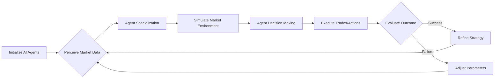

# The AI Agent Swarm Strategy: Automating High-Stakes Financial Markets

## Overview
This course provides an in-depth examination of how advanced AI models, specifically Claude, can be leveraged to create sophisticated, autonomous agent swarms capable of performing complex, high-value tasks like market trading. We will explore the architectural principles of using AI as a "brain" and a "sim engine" to achieve significant financial outcomes, focusing on the concepts behind the recent case study where an agent swarm generated substantial profits. This course is essential for understanding the bleeding edge of AI application in finance and automation.

## Background & Context
The landscape of Artificial Intelligence is rapidly evolving from simple chatbots to autonomous AI agents—systems designed to perceive their environment, make decisions, and take actions to achieve goals. The emergence of AI Agents signals a shift from using AI as a singular tool for content generation or coding to using it as a distributed, autonomous workforce. This concept of an "agent swarm," where multiple specialized AI entities work together, represents a new paradigm for automating complex, multi-step tasks that traditionally required human intervention and extensive computational effort. This strategy capitalizes on the ability of large language models (LLMs) to handle reasoning, planning, and execution, fundamentally changing how complex strategies are developed and executed in fields like finance and trading.

This strategy fits into the broader landscape of advanced AI applications by moving beyond simple query-response systems toward building fully functional, goal-oriented systems. It addresses the need for highly complex automation where decision-making involves analyzing multiple data streams, simulating outcomes, and executing real-world transactions simultaneously. The key innovation is not just using AI for analysis, but using AI to manage a dynamic, self-correcting system—the agent swarm—to execute profit-seeking strategies.

## Core Concepts

### AI Agents
An AI Agent is a system designed to perceive its environment, process information, make decisions, and take actions to achieve a predefined goal. Unlike a traditional script or algorithm that follows fixed instructions, an AI Agent possesses the capability for reasoning, planning, self-correction, and dynamic interaction with external tools (APIs, web browsers). In the context of finance, an agent is not just an analyst; it is an actor capable of monitoring market conditions, analyzing risk, setting trading parameters, and executing trades autonomously.

### Swarm of Agents
A swarm of agents refers to a distributed system where multiple specialized AI agents collaborate to solve a complex problem or achieve a collective goal. In this context, instead of a single agent executing a trade, a swarm comprises various agents, each specializing in a different role—one monitoring sentiment, another executing the trade, another simulating risk, and another managing the overall strategy. This distributed approach increases robustness, coverage, and complexity, allowing the system to handle multi-faceted problems that a single monolithic agent might struggle with.

### Claude as the Brain
When an advanced Large Language Model (LLM) like Claude is designated as the "brain," it means the model is responsible for the high-level reasoning, strategy formulation, goal setting, and complex decision-making. Claude functions as the central consciousness, interpreting complex market data, synthesizing the goals of the swarm, and determining the optimal path forward for the agents to follow. It handles the qualitative, strategic, and abstract thinking required for success, essentially turning raw data into actionable, intelligent strategy.

### Agent Swarm Sim Engine
The "Agent Swarm Sim Engine" is the underlying computational framework or simulation layer that allows the distributed agents to interact with each other, test hypothetical scenarios, and simulate the consequences of their proposed actions before actual execution. This engine handles the complex, iterative process of planning, communication, and scenario testing. It allows the system to perform risk assessment, evaluate potential profit margins ($5k–$15k profit per trade), and simulate the entire trading sequence within a controlled environment, significantly reducing the risk associated with real-world financial transactions.

## Deep Dive
### The Synergy of LLM and Swarm Architecture
The success of this strategy relies on the powerful synergy between the reasoning capabilities of the LLM (the brain) and the distributed execution capability of the agents (the swarm). Claude, acting as the brain, excels at understanding the nuanced, high-level objectives of trading on Polymarket and interpreting the complex, unstructured data found in market sentiment. It provides the strategic direction and the complex logic required to define *what* should be done.

The swarm of agents, powered by a model like Opus 4.7, then handles the tactical execution. These agents are specialized in specific tasks, such as scraping real-time BTC market data, monitoring Polymarket predictions, calculating risk exposure, and formatting the necessary instructions for execution. This separation of concerns—high-level strategy (Claude) versus low-level execution (the Swarm)—is critical. The swarm ensures that the strategy formulated by the brain is efficiently and accurately translated into actionable steps, making the entire process scalable and robust.

### Achieving High-Value Profit per Trade
The stated profit range of $5k–$15k profit per trade is not achieved through simple market arbitrage but through the agents' ability to perform complex, multi-layered simulations and optimizations. The agent swarm is trained to identify subtle, often overlooked, correlations between market sentiment (from Polymarket) and real-time price fluctuations (BTC markets). The simulation engine allows the swarm to test thousands of potential trading pathways, factoring in latency, slippage, and risk management. This iterative, multi-agent analysis allows the system to identify high-leverage opportunities that are often invisible to human traders or single-agent systems, thus maximizing the profit per successful transaction.

## Practical Application
The process of deploying this system involves several distinct, interconnected steps:

**Step 1: Defining the Objective (Claude as the Brain)**
The first step is instructing Claude (the brain) to define the overarching goal. This involves specifying the market (BTC), the platform (Polymarket), and the desired outcome (e.g., maximizing profit from speculative market movements). Claude synthesizes this into a high-level trading strategy, defining the rules, risk parameters, and the desired profit range.

**Step 2: Agent Swarm Initialization (Powering the System)**
Next, the system initializes the swarm of agents, powered by a sophisticated model like Opus 4.7. These agents are instantiated, and each is assigned a specific role: data ingestion, sentiment analysis, price tracking, risk calculation, and execution preparation. This phase establishes the distributed workforce ready to operate.

**Step 3: Simulation and Optimization (The Sim Engine)**
The core work happens in the Agent Swarm Sim Engine. The agents interact with each other and the market data to simulate thousands of possible trading scenarios. They test whether different combinations of actions lead to the desired profit range ($5k–$15k profit per trade) while staying within predefined risk limits. The simulation engine identifies the most profitable and safest pathways.

**Step 4: Execution (Real-World Trading)**
Once the simulation confirms a high-probability, low-risk strategy, the system moves to execution. The agents translate the optimized simulation plan into actual trades on the Polymarket and BTC markets. This involves interfacing with external APIs to execute the transactions rapidly and accurately, leveraging the speed of the automated system.

## Key Insights & Takeaways
*   The future of finance and complex task automation lies in deploying distributed AI agent swarms rather than relying on single monolithic models.
*   The most powerful application of an LLM like Claude is not just generating text, but acting as the high-level strategic "brain" that defines complex, multi-step goals for the agents.
*   Achieving high-value returns ($5k–$15k profit per trade) is possible when the system incorporates an Agent Swarm Sim Engine, allowing for robust simulation and optimization of risk-aware strategies before execution.
*   Successful AI agent strategies require separating the high-level strategic planning (the brain) from the low-level, distributed execution (the swarm).
*   The concept of a swarm allows for resilience; if one agent fails or encounters an unexpected market event, the other agents can compensate and continue the goal, increasing the system's robustness.
*   Automated systems excel at complex correlation finding and risk management, which are often bottlenecks for human traders.

## Common Pitfalls / What to Watch Out For
1.  **Over-Reliance on the Brain:** A common mistake is treating the LLM (Claude) as the sole executor. If the reasoning is too abstract or vague, the resulting agent actions can be nonsensical or dangerous. The human must carefully define the reward functions and constraints for the LLM to ensure the strategy aligns with real-world financial risk.
2.  **Neglecting the Sim Engine:** Rushing directly from planning to execution without a robust simulation engine is highly dangerous in finance. Failing to rigorously test scenarios before deployment can lead to catastrophic losses when dealing with real market volatility.
3.  **Ignoring Agent Communication:** If agents are not properly structured to communicate their findings and reconcile their data, the swarm can become fragmented, leading to conflicting actions or system errors. Effective swarm design requires explicit protocols for information sharing and consensus building.
4.  **API and Tool Integration Errors:** Financial systems rely heavily on real-time data and accurate execution. Errors in integrating external APIs for trading (like those for BTC or Polymarket) can lead to incorrect trades, slippage, or outright system failure.

## Review Questions
1.  Explain the fundamental difference between using Claude as the "brain" and the "Agent Swarm Sim Engine" in the context of the trading strategy.
2.  Describe the role of the Agent Swarm in achieving a $5k–$15k profit per trade, detailing how the simulation engine contributes to this outcome.
3.  What are the primary risks associated with deploying an AI agent swarm for high-stakes financial trading, and how can the discussed pitfalls be avoided?

## Further Learning
To build upon this foundational knowledge of AI Agent Swarms, the reader should explore the following areas:

*   **Advanced Agent Frameworks:** Dive into specific frameworks like AutoGen, CrewAI, or LangChain, which provide the technical scaffolding necessary to define and manage complex agent interactions and tool usage.
*   **Reinforcement Learning (RL) in Agents:** Explore how Reinforcement Learning techniques can be integrated into agent swarms to allow them to learn optimal trading strategies through continuous, real-world interaction and feedback, moving beyond static simulation.
*   **Ethical AI in Finance:** Study the regulatory and ethical implications of fully autonomous trading systems and the responsibility of the human overseer in an AI-driven financial environment.
*   **Multi-Agent System Design:** Focus on architectural patterns for designing resilient, distributed systems. This includes studying decentralized decision-making and consensus mechanisms to ensure the swarm remains cohesive under stress.

<!-- auto-diagram -->

