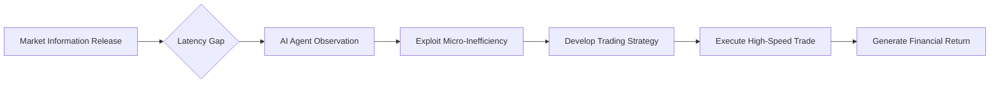

# The Art of Latency Exploitation with AI Agents in Financial Trading

## Overview
This course explores the cutting-edge intersection of Artificial Intelligence Agents, large language models (LLMs), and high-frequency trading strategies. We will delve into how sophisticated automation can exploit micro-level market inefficiencies—specifically latency—to generate massive financial returns. This deep dive teaches the principles of agent design, prompt engineering, and algorithmic exploitation, transforming complex AI capabilities into tangible, high-value trading systems.

## Background & Context
The modern financial landscape is characterized by extreme speed. High-frequency trading (HFT) relies on milliseconds of information advantage, making latency a critical determinant of profit or loss. Traditional predictive models often fail because they are operating on delayed data. This is where AI Agents, powered by LLMs like Claude, introduce a revolutionary new approach. Instead of attempting to *predict* the future market (which is immensely complex), these agents are designed to *exploit* the current, temporary state of the market—specifically, the delay (latency) between when information is released and when it is acted upon by other participants. This knowledge positions AI Agents not merely as predictors, but as tactical exploiters.

The emergence of sophisticated AI Agents is reshaping how automation is approached. These agents are no longer limited to simple data analysis; they can engage in complex reasoning, tool use, and sophisticated execution planning. This knowledge fits into the broader landscape of AI Agents by demonstrating their ability to execute novel, non-obvious strategies that leverage the structural weaknesses inherent in existing market mechanics, moving the field from passive analysis to active, exploitative strategy generation.

## Core Concepts

### AI Agents and Automation
AI Agents are autonomous systems designed to perceive an environment, make decisions, and take actions to achieve a specific goal without continuous human intervention. Unlike simple predictive models, agents possess the ability to plan multi-step strategies, interact with external tools (like APIs), and dynamically adjust their behavior based on real-time feedback. In finance, this means moving beyond simple signal generation to creating full, self-executing trading workflows.

### Latency Exploitation
Latency refers to the delay in the transmission of information across a network or the delay in the execution of a transaction. In high-frequency trading, exploiting this delay is a key strategy. When market data is disseminated, there is a brief window where different market participants act on slightly different, delayed pieces of information. An AI Agent can be programmed to identify and capitalize on these micro-second differences, effectively using the timing of information release as an advantage rather than trying to predict the true future value.

### Prompt Engineering as Reverse Engineering
Prompt engineering is the practice of crafting specific instructions for a Large Language Model (LLM) to elicit desired outputs. In this context, "reverse engineering" refers to the process of meticulously crafting a prompt that forces the LLM to reveal or construct a complex, hidden strategy or algorithmic logic. This turns the LLM from a general knowledge generator into a specialized, code-like reasoning engine capable of formulating intricate, exploitative trading strategies based on observed market dynamics and system constraints.

### The Role of Claude (LLM)
Claude is a specific, advanced Large Language Model developed by Anthropic, known for its strong reasoning capabilities and context handling. When utilized for agent development, models like Claude excel at complex, multi-step reasoning required for strategy formulation. Their strength lies in synthesizing vast amounts of textual data (market reports, historical data, system documentation) and translating that knowledge into actionable, coherent instructions that guide an automated agent's decision-making process.

## Deep Dive

### The Mechanism of Latency Exploitation in Trading
The core mechanism relies on exploiting the asymmetry of information flow. Imagine a market where a significant piece of information (e.g., a large order placement or a news event) is released to some participants slightly before it is fully reflected in the order books seen by others. An AI Agent designed for latency exploitation would monitor these market feeds, calculate the differential delay ($\Delta t$), and execute a trade based on the immediate, yet delayed, information. This is not prediction; it is timing. The agent exploits the operational lag in the market infrastructure itself, turning infrastructural delay into a profit opportunity.

### Reverse Engineering the Bot
Reverse engineering, in this context, is the process of understanding the hidden logic within an already functional, high-performing trading bot. Instead of building a strategy from scratch, the student in the source utilized an LLM (Claude) to reverse-engineer the logic. This process involves providing the LLM with the bot’s operational parameters, historical trades, or even fragmented code snippets, and asking the LLM to infer the underlying decision-making rules. The LLM synthesizes this information and outputs a coherent set of instructions or the necessary code logic required to replicate the bot's successful execution strategy, minimizing the time spent on manual coding or iterative testing.

### The Power of the Claude Prompt
The prompt serves as the agent's initial command—the blueprint for the complex strategy. When used effectively, a single, well-engineered prompt can contain all the necessary contextual constraints, market parameters, risk management rules, and the specific exploitation methodology required. This contrasts with traditional coding, where developers must manually define every conditional statement. With an LLM, the complexity of the strategy is encoded in the prompt's high-level instructions, allowing the model to fill in the granular details and operational logic required for effective latency exploitation.

## Practical Application

### Step-by-Step Strategy Implementation
1. **Define the Goal and Constraints (The Prompt):** Start by defining the objective—exploiting latency for profit—and setting strict constraints, such as the starting capital ($0.90) and the target return. Specify the constraints on execution and risk management (e.g., maximum drawdown).
2. **Input the Observed Dynamics (The Data):** Feed the agent with real-time or historical market data feeds, focusing specifically on timestamps and order book movements, which are the signals for latency.
3. **Reverse Engineer the Logic (The LLM Step):** Instruct the LLM (e.g., Claude) to analyze the input data and infer the optimal timing and execution sequence required to exploit the latency window. This involves prompting the model to generate the strategy rules or the execution logic.
4. **Agent Execution (The Bot):** The inferred logic is translated into executable code or trading instructions. The Agent then monitors the market, waits for the specific latency window to open, and executes the trade precisely according to the reverse-engineered rules.
5. **Iterate and Optimize:** Continuously feed the agent's performance metrics back into the system, allowing the agent to refine its strategy based on actual market reactions and adjust the exploitation timing.

### Real-World Scenarios
**Scenario 1: Arbitrage on Data Feed Delay**
An agent is tasked with monitoring two different data feeds for a specific asset (e.g., a cryptocurrency exchange). If Feed A registers a price change 50 milliseconds before Feed B, the agent exploits this 50ms window. The agent is programmed to execute a buy order based on the slightly older, yet actionable, data from Feed A, before Feed B fully updates, thus capitalizing on the time difference.

**Scenario 2: Exploiting Order Book Asymmetry**
The agent monitors the depth of the order book. If the agent detects a pattern where large orders are being placed in one direction but are not yet fully reflected in the visible depth, it exploits this asymmetry. The agent uses its knowledge to predict the immediate price movement that will occur once the delayed information is processed, allowing it to place a profitable trade right at the inflection point created by the delay.

**Scenario 3: Dynamic Strategy Generation**
Instead of a fixed strategy, the agent is prompted to dynamically generate a strategy based on current volatility. If volatility is high, the agent deploys a tighter, faster latency strategy; if volatility is low, it deploys a wider, slower strategy. This dynamic adjustment, guided by the LLM's reasoning, ensures the agent remains adaptive and maximally exploitative across changing market conditions.

## Key Insights & Takeaways
*   AI Agents can be designed to exploit structural weaknesses in market infrastructure, such as latency, rather than relying solely on predictive analysis.
*   The power of an AI Agent in finance lies in its ability to execute complex, multi-layered strategies that leverage real-time timing and operational delays.
*   Prompt engineering serves as a powerful reverse engineering tool, allowing users to derive sophisticated, exploitative algorithmic logic from a powerful LLM in minutes.
*   Latency exploitation is a strategy focused on market mechanics and information flow, not on predicting the absolute future price movements.
*   Successful application requires defining precise, constrained rules for the agent, ensuring that the LLM's reasoning is translated into precise, executable trading instructions.
*   The combination of an LLM's reasoning capability and an agent's execution capability creates a synergistic system capable of finding non-obvious, high-leverage opportunities.

## Common Pitfalls / What to Watch Out For
*   **Over-reliance on Prediction:** A common mistake is attempting to use the agent purely for predictive modeling. The success of this method hinges entirely on exploiting timing (latency), not on accurately predicting future prices, which is an astronomically harder task.
*   **Ignoring Risk Management:** Exploiting latency can be extremely risky. If the timing is slightly off, the trade can result in immediate, significant losses. Strict, automated stop-loss mechanisms must be built into every execution instruction.
*   **Vague Prompting:** Providing vague instructions to the LLM will result in generic, unusable strategies. The prompt must be hyper-specific, defining the exact rules of latency exploitation and the constraints of the execution environment.
*   **System Latency Blindness:** Developers must meticulously account for not only the market latency but also the internal latency of the AI system itself. Failures in synchronization can lead to incorrect, harmful trade execution.

## Review Questions
1. How does the strategy of exploiting latency fundamentally differ from a traditional market prediction strategy, and why is this approach more potent for AI Agents?
2. Explain the role of the Claude prompt in the reverse engineering process. What kind of knowledge does the LLM synthesize, and how is this knowledge translated into an executable trading strategy?
3. Describe the step-by-step process an AI Agent would follow to exploit a 50-millisecond latency window in a financial market, focusing on the inputs, the reasoning step, and the final execution.

## Further Learning
*   **Reinforcement Learning (RL) in Finance:** Explore how RL algorithms can be used to optimize the execution strategy of the AI Agent, improving the timing and risk management beyond the initial prompt.
*   **Asynchronous Data Processing:** Study advanced techniques for handling asynchronous data feeds and optimizing data pipelines to truly minimize observed latency in real-time trading environments.
*   **Agent Frameworks (LangChain, AutoGen):** Dive into specific frameworks that facilitate the creation of complex, multi-tool AI Agents, learning how to connect LLMs to external APIs (brokerage APIs, data feeds) for live execution.
*   **High-Frequency Trading (HFT) Infrastructure:** Understand the physical and network infrastructure that dictates true latency, learning about co-location, dedicated network lines, and low-level systems necessary for genuine HFT.

<!-- auto-diagram -->

