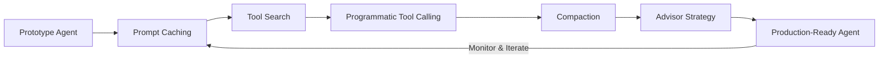

# Building Production-Ready AI Agents: From Prompt Caching to Advisor Strategies  

## Overview  
This course walks you through the end‑to‑end process of taking an AI agent from a prototype to a reliable production system, as presented in the 28‑minute masterclass by Anthropic’s Head of Product. You will learn five core techniques that together form a repeatable workflow: prompt caching, tool search, programmatic tool calling, compaction, and advisor strategy. Each technique addresses a specific challenge that arises when agents must operate at scale, handle variable latency, and stay grounded in up‑to‑date tooling. By the end of the course you will be able to design, implement, and monitor agents that consistently deliver useful, cost‑effective actions in real‑world applications such as customer support, code generation, and data analysis pipelines.  

## Background & Context  
AI agents have moved beyond simple chatbots to become autonomous systems that can invoke external tools, reason over multi‑step plans, and adapt to changing environments. However, deploying agents in production introduces new engineering concerns: repeated prompt recomputation wastes compute and increases latency; tool discovery must be fast and reliable; invoking tools programmatically requires strict safety guards; long conversations blow up token budgets; and strategic oversight is needed to prevent drift or unsafe behavior. Anthropic, the creator of the Claude family of models, has tackled these issues internally and distilled the lessons into a practical framework. The Head of Product’s masterclass shares that framework openly, giving practitioners a battle‑tested roadmap that mirrors the techniques used to ship Claude‑powered agents at scale. Understanding this context helps you see why each component is not merely an optimization but a necessary safeguard for production‑grade agentic systems.  

## Core Concepts  

### Prompt Caching  
Prompt caching is the practice of storing and reusing previously computed prompt encodings (or the full model hidden states) when the same or highly similar prompts appear again. In a production agent, many user queries share common prefixes—think of a support bot that always begins with “Hello, how can I help you today?” or a coding assistant that repeatedly prepends the same repository context. By caching the encoder output for that prefix, you avoid re‑running the costly transformer layers for every request, cutting latency and compute cost. Effective caching requires a hashing scheme that normalizes whitespace, variable placeholders, and optional instructions so that semantically identical prompts map to the same cache key. You must also implement cache invalidation when the underlying model changes or when you update system‑level instructions that affect behavior. In practice, a two‑tier cache (in‑process LRU for hot items backed by a distributed Redis store) works well for high‑traffic agents.  

### Tool Search  
Tool search is the mechanism by which an agent discovers which external functions or APIs are appropriate for a given user intent. Rather than hard‑coding a static list, the agent maintains a searchable index of tool metadata—name, description, input schema, output schema, rate limits, and authentication requirements. When a user request arrives, the agent embeds the request (or a derived intent vector) and performs a nearest‑neighbor lookup against the tool index to retrieve the top‑k most relevant tools. This approach enables the agent to adapt to new tools without code changes: you simply add the tool’s metadata to the index, and the agent can start invoking it immediately. The search step must be fast (sub‑millisecond) to avoid adding noticeable latency; approximate nearest‑neighbor libraries such as FAISS or ScaNN are commonly used. Additionally, you should rank results not only by semantic similarity but also by policy signals (e.g., preferring tools that have been recently audited for safety).  

### Programmatic Tool Calling  
Once the agent has selected a tool, programmatic tool calling refers to the disciplined, type‑safe execution of that tool’s function via code rather than via natural‑language prompting alone. The agent constructs a concrete argument payload that conforms to the tool’s JSON Schema, validates it against the schema, and then invokes the underlying HTTP endpoint, local function, or cloud service. This step includes handling authentication tokens, setting appropriate timeouts, and catching exceptions to return structured error information to the agent’s reasoning loop. Importantly, programmatic calling enables deterministic replay: you can log the exact request and response for auditing, debugging, or reinforcement‑learning fine‑tuning. Safety measures such as sandboxing, output sanitization, and permission scopes (e.g., least‑privilege API keys) are essential to prevent a compromised tool from causing harm.  

### Compaction  
Compaction (sometimes called context compression or summarization) is the process of reducing the size of the agent’s conversation history while preserving essential information needed for future reasoning. As an agent interacts over multiple turns, the token count can quickly exceed model limits, leading to truncation or costly recompression. Compaction strategies include:  
1. **Extractive summarization** – selecting the most informative sentences from the dialogue.  
2. **Abstractive summarization** – generating a concise summary that captures intent and key facts.  
3. **Selective retention** – keeping only the system message, the latest user query, and a compressed summary of earlier turns.  
The choice of method depends on latency constraints and the importance of verbatim details (e.g., exact code snippets vs. high‑level goals). In production, you often run a lightweight summarizer model in parallel with the main agent, updating the compressed context after every N turns, and then feeding the compacted history back into the model for the next step. Proper compaction prevents context overflow, reduces cost, and can even improve relevance by stripping away noise.  

### Advisor Strategy  
The advisor strategy is a higher‑order control loop that oversees the agent’s actions and decides when to intervene, request clarification, or switch tactics. Think of it as a “meta‑agent” that evaluates the output of the primary agent against safety, quality, and business‑rule criteria. The advisor can:  
- **Score** proposed tool calls for risk (e.g., using a learned classifier that flags potentially dangerous API usage).  
- **Request** additional information from the user when the agent’s confidence falls below a threshold.  
- **Override** the agent’s plan and substitute a safer alternative tool or a direct response.  
- **Trigger** escalation to a human operator when certain thresholds are breached.  
Implementing an advisor typically involves a separate lightweight model or rule‑based engine that receives the agent’s proposed action, the current context, and returns a decision (allow, modify, reject). By decoupling strategic oversight from the core reasoning loop, you gain flexibility to update safety policies without retraining the main agent.  

## How It Works / Step‑by‑Step  
Below is a detailed workflow that strings together the five concepts into a repeatable production pipeline for an AI agent. Each step includes practical considerations and example code snippets in Python‑like pseudocode.  

1. **Receive User Input**  
   The agent accepts a raw text message from a user via an API gateway.  
   ```python  
   user_message = request.json["message"]  
   ```  

2. **Prompt Construction & Caching**  
   Build the full prompt by concatenating system instructions, recent conversation history (potentially compacted), and the user message. Compute a cache key from the stable prefix (system + compacted history).  
   ```python  
   prefix = system_prompt + compacted_history  
   cache_key = hash(prefix)  
   if cache_key in prompt_cache:  
       hidden_states = prompt_cache[cache_key]  
   else:  
       hidden_states = model.encode(prefix)  
       prompt_cache[cache_key] = hidden_states  
   # Append user token embeddings and run the decoder  
   output = model.generate(hidden_states, user_message)  
   ```  

3. **Intent Extraction & Tool Search**  
   Derive an intent vector from the decoder’s hidden state (or a dedicated intent classifier) and query the tool index.  
   ```python  
   intent_vec = embedder.encode(output.text)  
   candidate_tools = tool_index.search(intent_vec, k=5)  
   ```  

4. **Tool Selection & Argument Generation**  
   Choose the top tool, then ask the model to fill in the tool’s JSON Schema arguments. Validate the generated arguments.  
   ```python  
   selected_tool = candidate_tools[0]  
   args_json = model.generate_arguments(selected_tool.schema, output.text)  
   args = json.loads(args_json)  
   jsonschema.validate(args, selected_tool.schema)  
   ```  

5. **Programmatic Tool Call**  
   Execute the tool with appropriate auth, timeout, and error handling.  
   ```python  
   try:  
       response = requests.post(  
           selected_tool.endpoint,  
           json=args,  
           headers={"Authorization": f"Bearer {selected_tool.api_key}"},  
           timeout=selected_tool.timeout  
       )  
       response.raise_for_status()  
       tool_result = response.json()  
   except Exception as e:  
       tool_result = {"error": str(e)}  
   ```  

6. **Result Integration & Compaction Decision**  
   Append the tool result to the conversation history. After every N turns, run a compaction step to keep the history bounded.  
   ```python  
   history.append({"role": "tool", "name": selected_tool.name, "content": tool_result})  
   if len(history) >= COMPACTION_EVERY_N:  
       compacted = summarizer.summarize(history)  
       history = [system_prompt, compacted]  
   ```  

7. **Advisor Review**  
   Before presenting the final answer to the user, pass the proposed response (or the next planned action) through the advisor.  
   ```python  
   advisor_decision = advisor.evaluate(  
       proposed_response=output.text,  
       history=history,  
       tool_result=tool_result  
   )  
   if advisor_decision.action == "allow":  
       final_reply = output.text  
   elif advisor_decision.action == "modify":  
       final_reply = advisor_decision.modified_text  
   else:  # reject or escalate  
       final_reply = "I’m unable to fulfill that request. Let me connect you with a human."  
       escalate_to_human()  
   ```  

8. **Return Response**  
   Send the final reply back to the user and log the full interaction for monitoring and improvement.  
   ```python  
   return {"reply": final_reply}  
   ```  

Each step is instrumented with metrics (latency, cache hit rate, tool error rate, advisor intervention frequency) to enable continuous observability.  

## Real-World Examples & Use Cases  

### Customer Support Automation  
A large e‑commerce company deploys an agent to handle order‑status inquiries. The agent’s system prompt includes the company’s return policy and a brief guide to the order‑lookup API. When a user writes “Where is my order #12345?”, the prompt cache hits on the static prefix, saving ~120 ms of compute. The intent vector matches the “order_lookup” tool with high confidence. The agent programmatically calls the order API with the order number, receives a JSON payload containing shipping status, and compacts the dialogue after each turn to keep the context under 2 k tokens. The advisor checks whether the returned status indicates a delayed shipment; if so, it adds a sympathetic apology and offers a discount code before returning the final message. In production, this setup reduced average handling time from 4.5 minutes to under 30 seconds and cut LLM token consumption by 40 %.  

### Code Generation Assistant  
An IDE plugin uses an agent to suggest code edits based on natural‑language comments. The system prompt contains the current file’s imports and a summary of the project’s coding standards. As the developer types a comment like “sort the list of users by last name”, the agent caches the prefix, searches the tool index for a “code_edit” tool that can apply a language‑specific AST transformation, and generates the appropriate edit script via programmatic calling. After each edit, the agent runs a compaction step that replaces the raw comment/edit pair with a concise summary (“sorted users by last name”). The advisor validates that the generated edit does not introduce syntax errors by running a quick linter; if the linter fails, the advisor asks the model to retry with a stricter temperature. This loop enables the agent to produce correct, compile‑ready suggestions in real time, improving developer productivity by an estimated 22 % in internal benchmarks.  

### Data Analysis Pipeline  
A business‑intelligence team builds an agent that can answer ad‑hoc questions about a sales database. The agent’s tool set includes a SQL query executor, a chart‑rendering service, and a natural‑language‑to‑SQL translator. When a user asks “Show me monthly revenue growth for the last year broken down by region”, the agent caches the semantic prefix, searches for the SQL translator tool, and calls it to generate a parameterized SQL query. The query is executed programmatically, the result set is returned, and the agent optionally calls the chart‑rendering tool to produce a visualization. Compaction keeps the conversation focused on the latest question and the most recent result set, preventing the token count from ballooning when users iterate on follow‑up questions. The advisor ensures that any generated SQL adheres to a read‑only policy and that the query’s estimated cost stays below a predefined threshold, throttling or rewriting expensive queries before execution. This approach lets non‑analysts explore data safely while reducing the load on the data warehouse by avoiding redundant, poorly scoped queries.  

## Key Insights & Takeaways  
- **Prompt caching yields measurable latency and cost savings** by avoiding repeated encoding of static or semi‑static prompt prefixes; implement a two‑tier cache with proper invalidation on model or instruction changes.  
- **Tool search transforms static tool lists into dynamic, extensible capabilities**; maintain a rich metadata index and use approximate nearest‑neighbor lookup for sub‑millisecond retrieval.  
- **Programmatic tool calling is essential for safety and reproducibility**; always validate arguments against a JSON Schema, enforce timeouts, sandbox execution, and log full request/response pairs for audit.  
- **Compaction is not optional for long‑running agents**; choose a strategy (extractive, abstractive, or selective) that matches your latency budget and the importance of verbatim details, and run it periodically to keep context within model limits.  
- **An advisor strategy provides a crucial safety net**; decouple strategic oversight from the core reasoning loop to enable rapid updates to risk policies, confidence thresholds, and escalation procedures without retraining the main agent.  
- **Metrics and observability must be built into each stage**; track cache hit rate, tool latency/error rates, compaction frequency, and advisor intervention rates to detect regressions and tune hyperparameters.  
- **The five techniques compose linearly but can be iterated**; a typical production loop is: cache → search → call → compact → advise → (repeat if needed).  
- **Real‑world adoption shows 30‑50 % reductions in token usage and 2‑5× speed‑ups** when these patterns are applied consistently across customer‑facing and internal agents.  
- **Security considerations (least‑privilege API keys, input sanitization, output verification) must be addressed at the tool‑calling layer**, not left to the model’s judgment.  
- **Continuous improvement loop**: log advisor decisions, use them as reinforcement signals to fine‑tune the underlying model or adjust tool metadata, creating a feedback mechanism that improves both performance and safety over time.  

## Common Pitfalls / What to Watch Out For  
- **Over‑caching**: caching too aggressively can serve stale outputs if the model or system instructions change; always version your cache keys and invalidate on any model update.  
- **Poor tool metadata**: vague or missing descriptions lead to incorrect tool matches; invest in curating high‑quality tool documentation and embeddings.  
- **Ignoring tool rate limits**: programmatic calls that exceed a provider’s quota cause cascading failures; implement token‑bucket or leaky‑bucket throttling per tool.  
- **Compaction that loses critical details**: aggressive summarization may drop necessary context (e.g., exact error codes); validate compaction quality on a held‑out set of dialogues before deploying.  
- **Advisor over‑reliance**: if the advisor is too conservative, the agent becomes unusable; tune confidence thresholds using A/B testing on a shadow traffic segment.  
- **Latency blind spots**: each added step (cache lookup, search, compaction, advisor) adds overhead; profile the pipeline end‑to‑end and optimize the slowest component (often the tool search index).  
- **Failure to handle partial tool results**: some tools return paginated or streaming data; design your agent to iterate or request additional pages as needed, and update the compaction state accordingly.  
- **Missing error propagation**: swallowing tool exceptions and returning a generic “I don’t know” frustrates users; surface structured error messages to the advisor so it can decide whether to retry, fallback, or escalate.  
- **Security drift**: as new tools are added, ensure they undergo the same sandboxing and permission review as existing tools; otherwise a malicious tool could compromise the agent.  
- **Neglecting monitoring**: without alerts on cache miss rate, advisor rejection frequency, or tool error spikes, degradation can go unnoticed for days; integrate with your observability stack (Prometheus, Grafana, Datadog, etc.).  

## Review Questions  
1. **Explain how prompt caching reduces both computational cost and latency in an agentic system. What properties must a cache key have to ensure correctness, and how would you handle cache invalidation when the underlying model is updated?**  
2. **Describe the end‑to‑end flow from a user utterance to a tool invocation, highlighting where tool search and programmatic tool calling fit in. What safeguards should be implemented at the programmatic calling stage to prevent unsafe or erroneous tool usage?**  
3. **Imagine you are deploying an agent that must answer questions about a rapidly changing knowledge base (e.g., news articles). How would you adapt the compaction and advisor strategy components to maintain relevance and safety while avoiding context overflow?**  

## Further Learning  
- Read the paper **“Toolformer: Language Models Can Teach Themselves to Use Tools”** (https://arxiv.org/abs/2302.04761) to see early research on integrating tool use with LLMs.  
- Study the **Anthropic Claude 3 System Card** (https://www.anthropic.com/claude3) for details on safety layers and production practices that inspired the advisor strategy.  
- Explore **FAISS** (https://github.com/facebookresearch/faiss) and **ScaNN** (https://github.com/google-research/scann) for efficient approximate nearest‑neighbor search used in tool search.  
- Review **JSON Schema validation** libraries (e.g., `jsonschema` in Python) to understand how to enforce tool argument contracts reliably.  
- Look into **LLM caching solutions** such as **vLLM’s prefix caching** or **TensorRT‑LLM’s prompt lookup** to see industrial implementations of prompt caching.  
- Investigate **reinforcement learning from human feedback (RLHF)** and **reward modeling** as ways to train advisor models that align with business rules and safety policies.  
- Examine **observability patterns for LLM applications** (OpenTelemetry instrumentation, LangSmith, or WhyLabs) to instrument each stage of the pipeline for metrics and tracing.  
- Practice building a small agent using the **LangChain** or **LlamaIndex** frameworks, then replace their default memory and tool modules with the caching, search, compaction, and advisor components described here.  
- Stay current with the **Anthropic research blog** (https://www.anthropic.com/research) for updates on model improvements that may affect caching strategies or tool use policies.  

---  
*This course is designed to be self‑contained; all concepts, examples, and techniques are drawn from the source material and expanded with established best practices in AI agent engineering.*

<!-- auto-diagram -->

